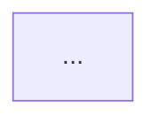

# CLAUDE.md

## 项目概述

开发者技术文档问答助手（RAG 模块）。用户粘贴技术文档 URL 或上传 PDF，系统异步爬取并建立向量知识库，支持自然语言问答，并附带可点击的引用溯源。

核心目标：**为开发者提供可追溯答案的技术问答系统（引用溯源不可妥协）**

当前阶段：原型开发，优先跑通核心链路。

---

## 技术栈

* 前端：Next.js + TypeScript + Tailwind
* 后端：FastAPI（Python 3.12）
* 向量数据库：PostgreSQL + pgvector
* 任务队列：Celery + Redis
* 存储：AWS S3
* Embedding：OpenAI text-embedding-3-small
* LLM：OpenAI gpt-4o
* 爬虫：Firecrawl
* ORM：SQLAlchemy + Alembic
* 工具链：LangChain
* 容器：Docker Compose

---

## 核心架构（不可修改）

RAG 流程：URL → Firecrawl → Markdown → Chunking(512/64) → Embedding → pgvector → 检索(向量+BM25+Rerank) → gpt-4o → 答案+citations

---

## 核心约束

* 每次回复都需要用中文回复。
* 所有答案必须附带 citations
* chunk metadata 必须包含：source_url、heading_path、chunk_index
* 禁止生成无来源答案 / 跳过 rerank / 直接访问 DB（必须走 services）
* 所有函数必须类型注解 / 所有配置走环境变量 / 不允许硬编码 key
* 数据库变更必须走 Alembic

---

## 代码结构（严格分层）

* api/：只处理请求/响应
* services/：业务逻辑
* tasks/：Celery 异步任务
* models/：数据库模型

---

## Feature 开发流程

### Step 1：Spec（路径：spec/{feature}.md）

使用 `spec/_template.md` 作为起点，必须包含：

* 功能目标 / API 设计 / 数据结构 / 依赖模块 / 边界情况 / 测试点 / 验收 checklist

**spec 完成后必须生成 Mermaid 流程图**，附在 spec 文件末尾，格式：

流程图须覆盖：主流程、异常分支、状态流转。

### Step 2：Design

* 数据流 / 系统结构 / 与现有模块关系

### Step 3：Plan

* 拆分为小任务（每步 < 1 小时），标明修改文件

### Step 4：Execute

* 一次只执行一个步骤，完成后必须测试

### Step 5：Review

* 是否符合 CLAUDE.md / 是否符合测试要求
* 逐项确认验收 checklist

---

## AI 执行规则（强约束）

1. 禁止直接写代码，必须先确认 spec 存在且完整
2. 必须遵循流程：spec → design → plan → execute → test → review
3. 每次只实现一个小步骤，不跨模块修改
4. 每次执行必须输出：修改文件 / 如何验证 / 下一步
5. spec 不清晰时必须提问，不允许猜测
6. 不确定时必须提出方案对比，每次只改必要代码
7. 完成后必须自检（lint + test）

---

## 测试策略（必须执行）

* 单元测试：services 层逻辑
* 集成测试：FastAPI API / 知识库流程
* RAG 专项：citations 正确 / source_url 可追溯 / 不允许 hallucination
* 异常测试：爬取失败 / embedding 失败 / 空输入
* 每个 feature 必须新增测试，测试失败禁止继续开发，PR 前必须全部通过

---

## 压缩保留信息

本项目是开发者文档 RAG 系统。核心是 citations 可追溯。
技术栈：FastAPI + Next.js + pgvector + OpenAI。
流程：爬取 → chunk → embedding → 检索 → 生成。
严格分层：api / services / tasks。必须使用 spec 驱动开发。
