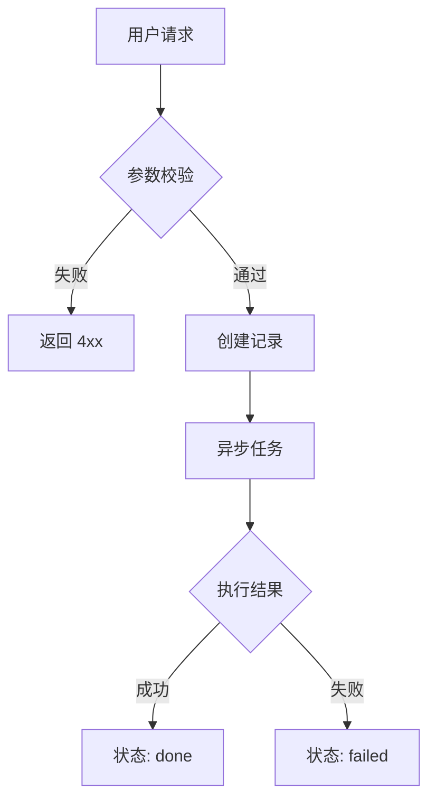

# {Feature Name} Spec

## 1. 功能目标

> 一句话描述这个功能要解决什么问题。

## 2. 依赖模块

> 列出依赖的已有模块（如 auth、knowledge_base 等），避免跨模块意外改动。

- 依赖：

## 3. 用户流程

1. 

## 4. API 设计

### POST /api/v1/{resource}

请求体：

- `field: type` — 说明

响应：

- `field: type` — 说明

## 5. 数据结构

### 表名

字段：

- `id`
- `created_at`

## 6. 核心处理规则

> 关键业务逻辑、状态流转、限制条件。

## 7. 边界情况

- 

## 8. 错误处理

- 参数错误：返回 4xx
- 异步失败：状态置为 `failed`，写入 `error_message`

## 9. 测试点

### API

- 

### 数据

- 

### 回归

- 不影响现有模块

## 10. 验收 checklist

- [ ] API 可正常调用
- [ ] 数据正确入库
- [ ] 异常情况返回正确状态
- [ ] 新增测试全部通过
- [ ] 不影响现有功能

---

## 流程图

