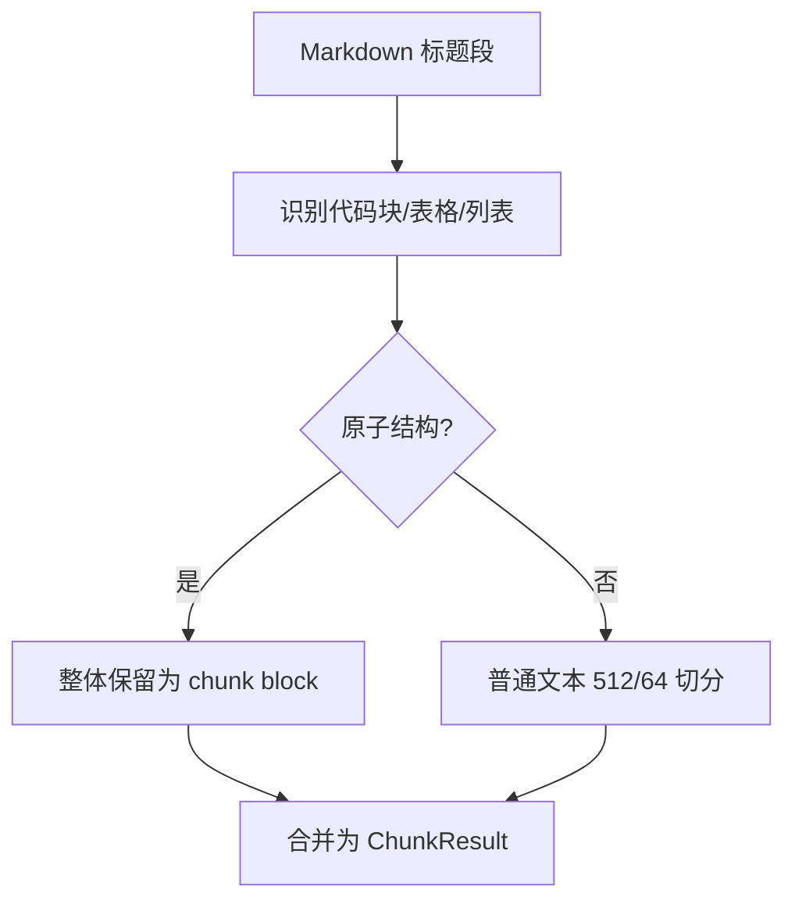

# Chunk Structure Aware Spec

> 分类：后端（Backend）

## 1. 功能目标

增强 Markdown chunking 策略，尽量避免技术文档中的代码块、表格、列表等原子结构被 `RecursiveCharacterTextSplitter` 二次切断，提升检索片段的语义完整性与 citations 可读性。

## 2. 依赖模块

- `chunking_service` — Markdown 标题切分后的二次分块
- `knowledge_tasks` — 入库主链路，调用 `split_markdown`
- `document_chunks` — 不新增字段，继续使用现有 metadata

## 3. 用户流程

1. 用户导入技术文档 URL。
2. Firecrawl 抓取 Markdown。
3. 系统按标题拆分文档。
4. 每个标题段内进一步识别结构化块：
   - fenced code block
   - Markdown table
   - Markdown list block
5. 原子结构优先整体保留；普通文本再按 `512/64` 切分。
6. 写入 chunk 与 metadata。

## 4. API 设计

不新增 API，不改变现有请求/响应结构。

## 5. 数据结构

不新增表，不新增字段。

`ChunkResult` 继续包含：

- `content`
- `heading_path`
- `chunk_index`

## 6. 核心处理规则

- 第一层仍按 Markdown 标题拆分。
- 第二层先识别原子结构：
  - 代码块：以 ````` 或 `~~~` 包裹
  - 表格：标题行 + 分隔行 + 连续表格行
  - 列表：连续无序/有序列表及缩进行
- 原子结构处理规则：
  - 正常长度时作为独立块保留
  - 超过 `CHUNK_SIZE` 时允许整体保留，不再强制截断
- 非原子文本仍使用 `RecursiveCharacterTextSplitter(chunk_size=512, chunk_overlap=64)`。

## 7. 边界情况

- 代码块未闭合：从起始 fence 一直保留到段末
- 表格只有单行但没有分隔行：按普通文本处理
- 列表中穿插空行：空行结束当前列表块
- 超长代码块：允许单块超过 `CHUNK_SIZE`

## 8. 错误处理

- 若结构识别异常，不中断切分，退回普通文本切分
- 超过 `MAX_CHUNKS`：沿用现有失败策略

## 9. 测试点

### 服务层

- fenced code block 不被二次切断
- Markdown table 不被二次切断
- 连续列表块不被二次切断
- 普通长文本仍按 `512/64` 切分

### 回归

- 不影响现有 `heading_path`
- 不影响 `chunk_index` 连续性
- 不影响 `MAX_CHUNKS` 校验

## 10. 验收 checklist

- [x] 代码块作为原子块保留
- [x] 表格作为原子块保留
- [x] 列表块作为原子块保留
- [x] 普通文本仍按 `512/64` 切分
- [x] 新增测试通过

---

## 流程图


