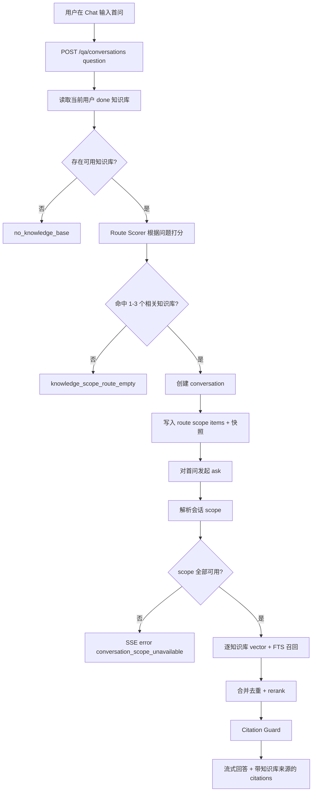

# Question Routed Knowledge Scope Spec

> 分类：后端（Backend）
> 状态：Draft

## 1. 功能目标

将当前“用户手动选择一个知识库后创建会话”的模型，升级为“用户只输入问题，系统根据问题自动路由到最相关知识库范围”的模型。

知识范围由 1 到 3 个已完成索引的知识库组成。首问创建会话时，后端基于用户问题、知识库名称、摘要、来源 URL 与轻量检索信号自动选择最多 3 个知识库，并将该结果锁定为会话 scope。后续问题只在该 scope 内继续检索，保证历史会话可复现。

本期不做用户明文多选知识库，不做全局可复用的“知识集合管理”。

## 2. 背景与当前状态

当前系统：

- `conversations.knowledge_base_id` 只保存单个知识库。
- `POST /api/v1/qa/conversations` 只接收 `knowledge_base_id`。
- 向量召回与 FTS 都按单个 `knowledge_base_id` 过滤。
- citations 不包含知识库名称，无法区分多库来源。
- 前端 `/chat` 草稿态使用单选下拉，要求用户先猜测问题属于哪个知识库。

单库模型保证了边界清晰，但在 Dev RAG 场景下限制较明显：一个项目资料通常拆成多个知识库，用户提问时不应该被迫猜答案在哪个知识库里。

## 3. 采用方案

采用“问题驱动的会话级知识范围 Scope”：

- 新建会话时前端提交用户首问，不提交 `knowledge_base_ids`。
- 后端根据首问自动选择 1 到 3 个最相关的已完成知识库。
- 会话创建成功后，route 结果写入 scope items 并锁定。
- 已有会话只读展示系统已选 scope，不允许用户中途切换。
- 后端检索、rerank、citation guard 只在该 scope 内执行。
- citations 必须标明来源知识库。

保留 `conversations.knowledge_base_id` 作为旧会话兼容字段；新逻辑优先读取 scope items，旧会话没有 scope items 时回退到 `knowledge_base_id`。

## 4. 不采用的方案

### 4.1 直接把 `knowledge_base_id` 改成数组

风险：

- 历史兼容与数据迁移边界不清晰。
- 无法保存知识库名称快照，知识库删除后历史范围展示会丢失。
- 后续如果要做可复用 scope / collection，会再次迁移。

### 4.2 前端明文多选知识库

风险：

- 仍然要求用户理解并选择知识库，产品负担没有真正消失。
- 会把“知识范围路由”的复杂性暴露给用户。
- 对 Dev RAG 来说，用户的问题本身已经包含路由信号，应优先由系统判断。

本期改为由系统基于问题自动选择 scope；前端只展示 route 结果与引用来源，不在提问前让用户手动勾选。

## 5. 数据模型

### 5.1 conversations 表

保留现有字段：

| 字段 | 类型 | 说明 |
| --- | --- | --- |
| `knowledge_base_id` | int nullable | 旧单库会话兼容字段，新会话可继续写入首个知识库 ID 作为兼容值 |

### 5.2 conversation_knowledge_scope_items 表（新增）

| 字段 | 类型 | 说明 |
| --- | --- | --- |
| `id` | int / bigint | 主键 |
| `conversation_id` | UUID | 外键 -> `conversations.id`，级联删除 |
| `knowledge_base_id` | int nullable | 外键 -> `knowledge_bases.id`，删除知识库时置空 |
| `knowledge_base_name_snapshot` | string(255) | 创建会话时的知识库名称快照 |
| `source_url_snapshot` | text | 创建会话时的来源 URL 快照 |
| `position` | int | 路由排序，从 0 开始 |
| `route_score` | float nullable | 路由阶段给出的相关性分数 |
| `route_reason` | text nullable | 路由原因摘要，用于 debug / UI 解释 |
| `created_at` | datetime | 创建时间 |
| `updated_at` | datetime | 更新时间 |

约束：

- 同一 `conversation_id` 下最多 3 条 scope item。
- 同一 `conversation_id + knowledge_base_id` 不允许重复。
- route 结果中的所有 `knowledge_base_id` 必须属于当前用户且状态为 `done`。

说明：

- `knowledge_base_id` nullable 是为了知识库被删除后，历史会话仍能展示当时使用过的范围。
- 如果 scope 中任一成员已删除，继续提问时返回 `conversation_scope_unavailable`，不静默缩小范围。

## 6. API 设计

### 6.1 POST /api/v1/qa/conversations

根据首问创建新对话，并自动路由知识库 scope。

请求体（新）：

```json
{
  "question": "生产环境怎么配置 Redis？"
}
```

兼容请求体（旧）：

```json
{
  "knowledge_base_id": 1
}
```

校验：

- 新路径必须提供 `question`，长度沿用 ask 问题限制。
- 用户必须至少有一个 `done` 状态知识库。
- 后端最多选择 3 个知识库进入 scope。
- 如果无法路由到任何相关知识库，创建会话失败，返回 `knowledge_scope_route_empty`。
- 旧请求 `knowledge_base_id` 继续兼容，用于历史前端或测试，但新前端不再使用。

响应：

```json
{
  "conv_id": "uuid",
  "knowledge_base_id": 2,
  "knowledge_base_ids": [2, 5],
  "knowledge_scope": {
    "type": "question_routed",
    "items": [
      {
        "knowledge_base_id": 2,
        "name": "部署文档",
        "source_url": "https://example.com/deploy",
        "route_score": 0.86,
        "route_reason": "问题包含生产环境与 Redis 配置，匹配部署文档摘要"
      }
    ]
  },
  "created_at": "2026-05-13T00:00:00Z"
}
```

### 6.2 GET /api/v1/qa/conversations

响应列表新增：

```json
{
  "conv_id": "uuid",
  "knowledge_base_id": 1,
  "knowledge_base_ids": [1, 2],
  "knowledge_scope": {
    "type": "question_routed",
    "items": [
      {
        "knowledge_base_id": 1,
        "name": "README",
        "source_url": "https://example.com/readme"
      },
      {
        "knowledge_base_id": 2,
        "name": "API 文档",
        "source_url": "https://example.com/api"
      }
    ]
  },
  "title": "如何部署到生产",
  "created_at": "2026-05-13T00:00:00Z",
  "updated_at": "2026-05-13T00:00:00Z"
}
```

兼容：

- 历史会话没有 scope items 但有 `knowledge_base_id` 时，后端可返回由单个知识库构造的 `knowledge_scope`。
- 历史会话 `knowledge_base_id = null` 时，`knowledge_base_ids = []`，继续问答返回 `conversation_scope_missing`。

### 6.3 GET /api/v1/qa/conversations/{conv_id}/messages

消息结构保持不变，但 citations 内部结构扩展，见 8.2。

### 6.4 POST /api/v1/qa/conversations/{conv_id}/ask

请求体保持不变：

```json
{
  "question": "生产环境怎么配置 Redis？"
}
```

新增错误码：

- `conversation_scope_missing`：会话没有可用范围。
- `conversation_scope_unavailable`：scope 中存在已删除或不可访问的知识库。
- `knowledge_scope_route_empty`：系统无法根据问题找到相关知识库。

## 7. 检索策略

### 7.1 Scope 路由

首问创建会话时：

1. 读取当前用户所有 `done` 状态知识库。
2. 用用户问题与知识库 `name`、`summary`、`source_url` 构造候选描述。
3. 使用轻量 route scorer 选择 1 到 3 个候选。
4. route scorer 可以分阶段实现：
   - v1：LLM 对知识库摘要打分，输出 top 3。
   - v2：结合摘要 embedding / 元数据检索，降低 LLM 成本。
   - v3：用每库轻量 chunk probe 召回结果增强评分。
5. route 结果写入 `conversation_knowledge_scope_items`。
6. 如果无候选或分数低于阈值，返回 `knowledge_scope_route_empty`。

后续提问时：

1. 读取当前会话。
2. 优先读取已锁定的 scope items。
3. 若 scope items 为空，回退 `conversations.knowledge_base_id`。
4. 校验 scope 中所有 `knowledge_base_id` 仍存在、属于当前用户、状态为 `done`。
5. 任一成员不可用则拒答，不自动缩小范围。

### 7.2 多库召回

不使用简单的 `WHERE knowledge_base_id IN (...) LIMIT top_k`。

推荐策略：

1. 对每个知识库分别执行 vector 召回。
2. 对每个知识库分别执行 FTS 召回。
3. 每个知识库使用 `RAG_VECTOR_TOP_K_PER_KB` 与 `RAG_FTS_TOP_K_PER_KB` 控制候选数。
4. 合并候选并按 chunk ID 去重。
5. 调用 rerank，统一取 `RERANK_TOP_N`。
6. 应用 `RAG_MIN_RERANK_SCORE`。

新增配置建议：

| 配置 | 默认值 | 说明 |
| --- | --- | --- |
| `RAG_SCOPE_MAX_KNOWLEDGE_BASES` | `3` | 单个会话自动路由最多知识库数 |
| `RAG_SCOPE_ROUTE_MIN_SCORE` | `0.35` | 知识库路由最低分数 |
| `RAG_SCOPE_ROUTE_MODEL` | `gpt-4o-mini` | v1 路由模型 |
| `RAG_VECTOR_TOP_K_PER_KB` | `10` | 每个知识库向量召回数量 |
| `RAG_FTS_TOP_K_PER_KB` | `10` | 每个知识库全文召回数量 |

说明：

- 最多 3 个知识库是产品约束，也是控制延迟和上下文污染的第一道边界。
- 后续如果有真实 eval 证明需要扩大，再单独评估。

## 8. Prompt 与 Citations

### 8.1 Prompt 上下文格式

多库 prompt 中每个 chunk 应显式带上知识库名称：

```text
[1] 知识库：API 文档
章节：Auth > Login
内容：...
```

这样模型在回答时更容易表达“根据 API 文档...”。

### 8.2 Citations 扩展

citations 新增知识库来源字段：

```json
{
  "index": 1,
  "chunk_id": "123",
  "knowledge_base_id": 2,
  "knowledge_base_name": "API 文档",
  "source_url": "https://example.com/api",
  "heading_path": "Auth > Login",
  "snippet": "..."
}
```

兼容：

- 前端解析时允许旧 citation 不包含 `knowledge_base_id` / `knowledge_base_name`。
- 新回答应尽量返回完整字段。

## 9. Telemetry / Debug / Eval

Telemetry 新增字段：

- `knowledge_base_ids`
- `scope_size`
- `scope_route_scores`
- `scope_route_reasons`
- `vector_candidates_count_by_kb`
- `fts_candidates_count_by_kb`
- `merged_candidates_count_by_kb`
- `selected_chunks_count_by_kb`

Debug retrieval 事件新增：

- scope 明细
- route 输入摘要与输出分数
- 每个知识库的召回数量
- rerank 后最终 chunk 来源分布

Eval 规则：

- 旧 fixture 保持支持 `knowledge_base_id`。
- 新 fixture 可支持 `knowledge_base_ids`。
- `knowledge_scope_match` 从单值比较升级为集合比较。
- citation match 可继续基于 URL，也可新增基于 `knowledge_base_id` 的断言。

## 10. 边界情况

- 用户没有任何 `done` 知识库：返回 `no_knowledge_base`。
- route 无相关知识库：返回 `knowledge_scope_route_empty`。
- route 输出超过 3 个知识库：后端截断到 3 个，并记录 debug。
- 历史会话没有 scope 且没有 `knowledge_base_id`：SSE error `conversation_scope_missing`。
- scope 中有知识库被删除：SSE error `conversation_scope_unavailable`。
- 多库检索无候选：沿用 `no_relevant_context`。
- citation 缺失：沿用 `missing_citations`。

## 11. 测试计划

### API

- `question` 创建会话时可自动写入 1 到 3 个 scope items。
- 用户没有 done 知识库时返回明确错误。
- route 无候选时返回 `knowledge_scope_route_empty`。
- 单个 `knowledge_base_id` 创建会话仍可兼容。
- 会话列表返回 `knowledge_scope`。

### Repository / Service

- 创建会话时基于问题 route 并写入 scope items。
- 历史单库会话可回退到 `knowledge_base_id`。
- scope 中任一知识库失效时拒答。
- vector / FTS 按每个知识库分别召回。
- rerank 后 citations 带知识库来源。

### RAG 回归

- 单库问答行为不退化。
- 多库问答不会召回 scope 外 chunk。
- citation guard 只接受当前 scope 的 chunk。
- telemetry 能看到每库召回分布。

## 12. 验收 Checklist

- [ ] 新会话可根据首问自动绑定 1 到 3 个知识库。
- [ ] 前端无需提交知识库 ID 即可创建会话。
- [ ] 自动 route 结果最多 3 个知识库。
- [ ] 已有会话范围锁定，不允许中途切换。
- [ ] 多库检索只在 scope 内执行。
- [ ] citations 展示来源知识库。
- [ ] 历史单库会话保持可用。
- [ ] scope 成员删除后继续问答会拒答。
- [ ] telemetry / debug 包含 scope 信息。

## 13. 流程图


