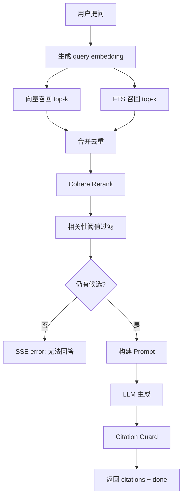

# Hybrid Retrieval Spec

> 分类：后端（Backend）

## 1. 功能目标

将当前 QA 检索链路从“纯向量召回 + rerank”升级为“向量召回 + PostgreSQL 全文检索 + rerank”的混合检索，提升术语、错误码、参数名、API 名称等精确匹配场景的召回稳定性。

## 2. 依赖模块

- `qa_service` — 当前问答主链路，负责召回、rerank、prompt、SSE
- `DocumentChunk` / `KnowledgeBase` — 检索数据来源与用户隔离
- `core.config` — 新增混合检索相关配置
- Alembic — 为 `document_chunks.content` 建立全文检索 GIN 索引

## 3. 用户流程

1. 用户提交问题。
2. 后端同时执行：
   - pgvector cosine 相似度召回 top-k
   - PostgreSQL full-text 检索 top-k
3. 合并两路召回结果并按 `chunk_id` 去重。
4. 对合并候选调用 Cohere Rerank。
5. 经过相关性阈值过滤后：
   - 有候选：进入 LLM 生成与 citations guard
   - 无候选：返回“根据已有文档，无法回答该问题”

## 4. API 设计

沿用现有接口：

### POST /api/v1/qa/conversations/{conv_id}/ask

不新增请求/响应字段，变化仅在服务端检索策略。

## 5. 数据结构

不新增表，不新增业务字段。

新增数据库索引：

- `ix_document_chunks_content_fts`
  - 类型：GIN
  - 表达式：`to_tsvector('simple', coalesce(content, ''))`

新增环境变量：

- `RAG_VECTOR_TOP_K: int` — 向量召回数量，默认 `20`
- `RAG_FTS_TOP_K: int` — 全文检索召回数量，默认 `20`

## 6. 核心处理规则

- 向量召回按用户 `user_id` 过滤。
- 全文检索也按用户 `user_id` 过滤。
- FTS 使用 PostgreSQL `websearch_to_tsquery('simple', :query)`。
- 两路召回合并时按 `DocumentChunk.id` 去重，保留首次出现顺序。
- rerank 输入为合并后的候选 chunks；后续相关性阈值、prompt、citations guard 沿用现有逻辑。
- 若 FTS 因 query 解析异常失败，不应中断问答，可降级为仅向量召回。

## 7. 边界情况

- 用户问题是自然语言描述：向量召回仍然提供主要覆盖。
- 用户问题包含 API 名、错误码、环境变量：FTS 提供补充召回。
- FTS 无结果：继续使用向量召回。
- 向量和 FTS 命中同一 chunk：合并去重后只保留一份。
- FTS 执行异常：降级为向量召回，不中断请求。

## 8. 错误处理

- 参数错误：返回 422。
- 对话无权限：沿用现有 SSE error。
- FTS 异常：记录并降级，不影响主流程。
- 两路召回都无候选：返回“请先导入知识库”或“根据已有文档，无法回答该问题”，沿用现有区分。

## 9. 测试点

### 服务层

- 向量结果与 FTS 结果可正确合并去重。
- FTS 结果为空时不影响向量结果。
- 两路召回都命中同一 chunk 时不会重复进入 rerank。

### 数据库

- Alembic 可创建 `document_chunks` 的 GIN FTS 索引。

### 回归

- 不影响现有 rerank 阈值过滤。
- 不影响 citation guard。

## 10. 验收 checklist

- [x] QA 检索链路支持向量召回 + FTS 混合召回
- [x] `document_chunks.content` 存在 GIN 全文索引
- [x] 合并候选时按 `chunk_id` 去重
- [x] FTS 异常时可降级为仅向量召回
- [x] 新增服务层测试通过
- [x] 不影响已有 citation guard 与相关性阈值测试

---

## 流程图

