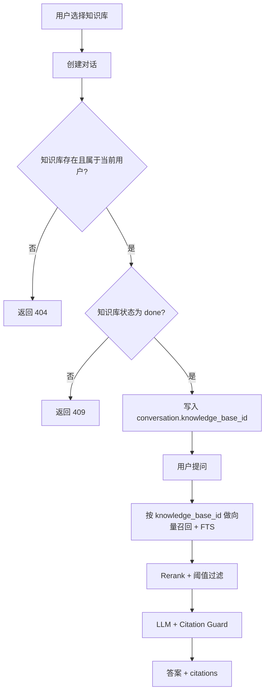

# Knowledge Scoped QA Spec

> 分类：后端（Backend）

## 1. 功能目标

为每个对话绑定单个知识库，确保问答检索、rerank 和 citations 只来源于当前对话指定的知识库，避免同一用户导入多份文档后发生跨库召回和错误引用。

## 2. 依赖模块

- `qa` — 对话创建、消息查询、问答 SSE
- `knowledge_base` — 已导入知识库及状态管理
- `qa_service` — 检索、rerank、citations 生成
- Alembic — conversations 表结构变更

## 3. 用户流程

1. 用户在 Chat 页面选择一个已完成索引的知识库。
2. 前端创建新对话时提交 `knowledge_base_id`。
3. 后端校验该知识库属于当前用户且状态为 `done`。
4. 对话创建成功后，后续所有提问都只在该知识库范围内检索。
5. 用户打开历史对话时，继续使用已绑定的知识库，无需再次选择。

## 4. API 设计

### POST /api/v1/qa/conversations

请求体：

- `knowledge_base_id: int` — 必填，当前对话绑定的知识库 ID

响应：

- `conv_id: str`
- `knowledge_base_id: int`
- `created_at: datetime`

### GET /api/v1/qa/conversations

响应列表新增：

- `knowledge_base_id: int | null`

说明：

- 兼容历史会话时允许返回 `null`

## 5. 数据结构

### conversations 表

新增字段：

- `knowledge_base_id: int | null` — 外键 -> `knowledge_bases.id`

说明：

- 数据库迁移阶段允许为空，以兼容已有历史记录
- 新创建的对话在应用层必须写入该字段

## 6. 核心处理规则

- 创建对话时必须校验：
  - 知识库存在
  - 知识库属于当前用户
  - 知识库状态为 `done`
- 向量召回和 FTS 召回都必须额外过滤 `KnowledgeBase.id == conversation.knowledge_base_id`
- 会话未绑定知识库时：
  - 不允许继续问答
  - SSE 返回错误，提示用户新建对话
- 不改变 citations 格式，不改变 rerank 和 citation guard 逻辑

## 7. 边界情况

- `knowledge_base_id` 不存在：返回 404
- `knowledge_base_id` 属于其他用户：返回 404
- 知识库还在 `pending/processing/failed`：返回 409
- 历史会话 `knowledge_base_id` 为空：SSE 返回 `conversation_scope_missing`
- 用户没有任何已完成知识库：前端引导去导入知识库

## 8. 错误处理

- 参数错误：返回 422
- 无权限或不存在：返回 404
- 知识库未完成索引：返回 409
- 历史会话缺少绑定：SSE error，不写 messages

## 9. 测试点

### API

- 创建对话时可成功写入 `knowledge_base_id`
- 非本人知识库不可创建对话
- 未完成索引知识库不可创建对话

### 服务层

- 向量召回按 `knowledge_base_id` 过滤
- FTS 召回按 `knowledge_base_id` 过滤
- 合并后的 chunks 不会跨知识库

### 回归

- 不影响已有 citations guard
- 不影响相关性阈值和 hybrid retrieval

## 10. 验收 checklist

- [x] 每个新对话都绑定单个知识库
- [x] QA 检索范围限定为当前对话绑定的知识库
- [x] 非本人或未完成索引的知识库不能创建对话
- [x] 历史未绑定对话不会继续产生跨库答案
- [x] 新增测试通过
- [x] 不影响现有 QA SSE 契约

---

## 流程图

