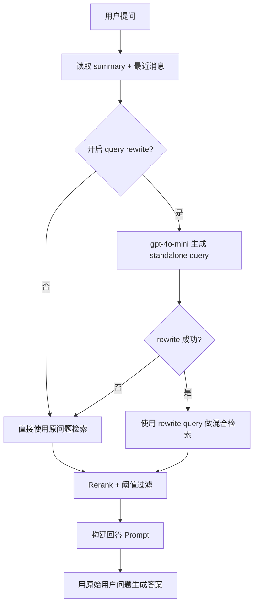

# Query Rewrite Spec

> 分类：后端（Backend）

## 1. 功能目标

在检索前把用户当前问题改写成更适合检索的 standalone query，减少口语表达、上下文指代、多轮追问对召回质量的影响。

## 2. 依赖模块

- `qa_service` — 当前问答主链路，负责检索、rerank、prompt、SSE
- `messages` / `conversations.summary` — 提供最近对话上下文
- OpenAI `gpt-4o-mini` — 生成 standalone query
- `core.config` — query rewrite 开关与模型配置

## 3. 用户流程

1. 用户提问。
2. 后端读取 `summary + 最近 4 条消息 + 当前问题`。
3. 后端生成一个 standalone retrieval query。
4. 混合检索使用 rewrite 后的 query。
5. 最终回答仍使用用户原始问题，不改前端展示。

## 4. API 设计

沿用现有接口：

### POST /api/v1/qa/conversations/{conv_id}/ask

不新增请求字段，不新增 SSE 事件类型。

## 5. 数据结构

不新增表，不新增字段。

新增环境变量：

- `RAG_QUERY_REWRITE_ENABLED: bool` — 是否开启 query rewrite，默认 `true`
- `RAG_QUERY_REWRITE_MODEL: str` — 改写模型，默认 `gpt-4o-mini`

## 6. 核心处理规则

- query rewrite 的输入：
  - `conversations.summary`
  - 最近 `KEEP_RECENT` 条消息
  - 当前问题
- query rewrite 的输出：
  - 单条独立查询语句
  - 不包含解释、编号、引号、额外格式
- rewrite 只用于检索：
  - embedding
  - FTS
  - rerank query
- 最终生成答案时：
  - 仍使用原始用户问题
  - 仍使用原有 citations guard
- rewrite 失败、超时、返回空文本时，降级为原始问题。

## 7. 边界情况

- 首轮问题没有历史：仍可改写口语问题；失败则回退原问题。
- 多轮追问含“它 / 那个 / 这里 / 这个配置”：优先补全成完整问题。
- 返回多行文本：只取首个非空行。
- 返回空字符串：回退原问题。

## 8. 错误处理

- rewrite 失败：静默降级为原始问题，不中断问答。
- 参数错误：沿用现有 422。
- 检索、rerank、LLM 生成错误：沿用现有逻辑。

## 9. 测试点

### 服务层

- rewrite 成功时返回 standalone query。
- rewrite 失败时回退原问题。
- rewrite 返回空字符串时回退原问题。
- disable 开关关闭时直接使用原问题。

### 回归

- 不影响 hybrid retrieval。
- 不影响 relevance threshold。
- 不影响 citation guard。

## 10. 验收 checklist

- [x] 检索前支持 standalone query rewrite
- [x] rewrite 只影响检索，不影响最终回答里的用户问题
- [x] rewrite 失败时自动回退原问题
- [x] 新增服务层测试通过
- [x] 不影响现有 QA SSE 契约

---

## 流程图

