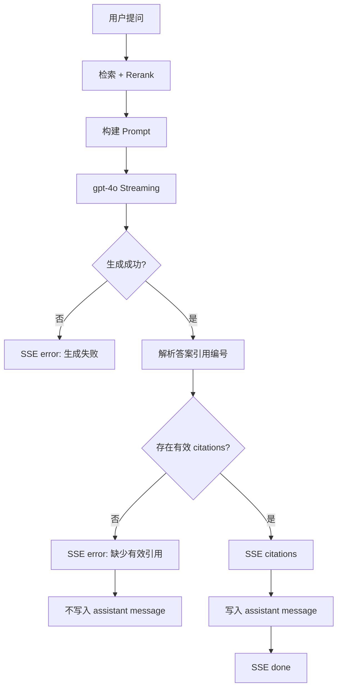

# RAG Citation Guard Spec

> 分类：后端（Backend）

## 1. 功能目标

确保 QA 生成链路不会把缺少有效 citations 的 assistant 答案作为可信答案返回或入库。引用溯源是本项目核心契约，答案必须能映射回已检索到的 `DocumentChunk`。

## 2. 依赖模块

- `qa_service` — 构建 prompt、流式生成答案、提取 citations
- `qa_repository` — 写入 user / assistant messages
- `DocumentChunk` — citations 映射来源，必须包含 `source_url`、`heading_path`、`chunk_index`
- 前端 Chat 流式状态 — 已支持 `error` 事件和 missing citations 告警

## 3. 用户流程

1. 用户在已有对话中提问。
2. 后端检索并 rerank 得到 top chunks。
3. 后端调用 LLM 流式生成答案。
4. 流结束后解析答案中的 `[1]`、`[2]` 引用编号。
5. 若至少存在一个有效引用编号，并能映射到本次 top chunks，则返回 `citations` 事件并写入 assistant message。
6. 若没有有效引用，后端返回 `error` 事件，不写入 assistant message。

## 4. API 设计

沿用现有接口：

### POST /api/v1/qa/conversations/{conv_id}/ask

请求体：

- `question: str` — 用户问题，非空，最长 1000 字

成功 SSE：

- `token`
- `citations`
- `done`

引用缺失 SSE：

- `error`

错误示例：

```json
{"type": "error", "message": "生成结果缺少有效引用，请重试"}
```

## 5. 数据结构

不新增表，不新增字段。

`messages.citations` 继续使用现有 JSONB 结构：

```json
[
  {
    "index": 1,
    "chunk_id": "uuid",
    "source_url": "https://...",
    "heading_path": "Installation > Redis",
    "snippet": "..."
  }
]
```

## 6. 核心处理规则

- citations 从 assistant 答案中的 `[n]` 编号解析。
- 只有 `1 <= n <= len(top_chunks)` 的编号算有效引用。
- 有效 citations 为空时：
  - SSE 返回 `error`
  - 不发送 `done`
  - 不写入 assistant message
  - 不触发摘要压缩
- 用户消息仍可保留，因为用户确实发起了提问。
- 不改变检索、rerank、prompt、conversation 权限逻辑。

## 7. 边界情况

- 模型完全没有输出 `[n]`：返回 citation guard error。
- 模型输出 `[99]` 等越界编号：无有效引用，返回 citation guard error。
- 模型混合输出 `[1] [99]`：保留 `[1]`，过滤越界编号，正常返回。
- 模型输出重复引用 `[1] [1]`：去重后返回一次。
- 生成 API 失败：沿用现有 `生成失败，请重试`。

## 8. 错误处理

- 参数错误：返回 422。
- 对话无权限：SSE error，沿用现有逻辑。
- 无知识库内容：SSE error，沿用现有逻辑。
- 生成结果缺少有效引用：SSE error，不写入 assistant message。

## 9. 测试点

### API

- 引用缺失时 SSE 返回 error，不返回 done。

### 数据

- 引用缺失时不写入 assistant message。
- citations 中 `source_url`、`heading_path`、`chunk_id` 映射自本次 top chunks。

### 服务层

- `[1]` 能生成 citations。
- 无 `[n]` 时触发 citation guard。
- 越界 `[99]` 时触发 citation guard。
- `[1] [99]` 时只保留有效引用。

### 回归

- 不影响 conversation 创建、消息列表、已有 citation 序列化格式。

## 10. 验收 checklist

- [x] 缺少 citations 的答案不会作为成功答案返回
- [x] 缺少 citations 的答案不会写入 assistant message
- [x] 有效 citations 的现有格式不变
- [x] 越界引用编号不会进入 citations
- [x] 新增服务层测试通过
- [x] 不影响现有 QA SSE 事件契约

---

## 流程图


