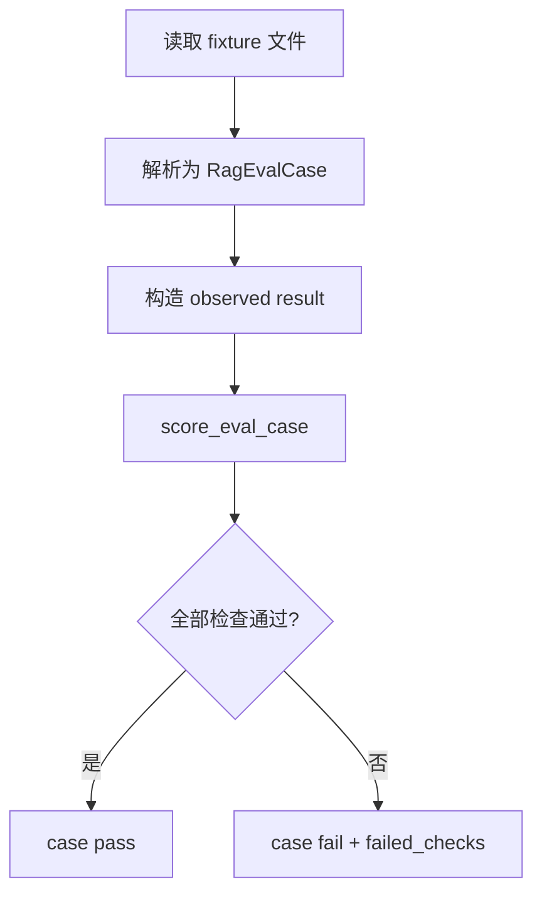

# RAG Eval Fixtures Spec

> 分类：后端（Backend）

## 1. 功能目标

为当前 RAG 问答链路建立一组可版本化的本地评测样例（fixtures）和最小打分逻辑，用于验证检索范围、query rewrite、拒答、citations 与回答命中等核心行为，形成后续改动的回归基线。

## 2. 依赖模块

- `qa_service` — 评测目标链路
- `knowledge scoped QA` — 验证不会跨库召回
- `query rewrite` — 验证 retrieval query 是否符合预期
- `citation guard` — 验证 citations 是否存在且可追溯

## 3. 用户流程

1. 开发者维护一份本地评测 fixture 文件。
2. 测试或脚本读取 fixture。
3. 对每个 case 运行打分逻辑，得到 pass/fail 和原因。
4. 后续接入真实链路时，可把链路输出映射为观察结果对象复用同一套规则。

## 4. API 设计

本期不新增 HTTP API。

新增内部接口：

- `load_eval_cases(path) -> list[RagEvalCase]`
- `score_eval_case(case, observed) -> RagEvalScore`

## 5. 数据结构

### Fixture 文件

建议放在：

- `backend/tests/fixtures/rag_eval_cases.json`

case 字段：

- `id: str`
- `category: str`
- `knowledge_base_id: int`
- `history: list[{role, content}]`
- `question: str`
- `expected_mode: "answer" | "refusal"`
- `expected_retrieval_query_contains: list[str]`
- `expected_answer_contains: list[str]`
- `expected_citation_urls: list[str]`

### 观察结果

- `knowledge_base_id: int | None`
- `retrieval_query: str`
- `answer: str`
- `citations: list[dict]`
- `outcome: "success" | "error"`
- `error_code: str | None`

### 打分结果

- `passed: bool`
- `checks: dict[str, bool]`
- `failed_checks: list[str]`

## 6. 核心处理规则

- `expected_mode = answer`
  - 需要 `outcome=success`
- `expected_mode = refusal`
  - 需要 `outcome=error`
- `knowledge_base_id` 必须匹配，防止跨库
- `expected_retrieval_query_contains`
  - 所有关键短语都必须出现在 retrieval query 中
- `expected_answer_contains`
  - 仅在 `expected_mode=answer` 时检查
- `expected_citation_urls`
  - 必须全部出现在 observed citations 中

## 7. 边界情况

- `expected_answer_contains` 为空：跳过答案内容检查
- `expected_citation_urls` 为空：跳过 citation URL 检查
- `retrieval_query` 为空：rewrite / retrieval query 检查失败
- `history` 为空：用于首轮问题样例

## 8. 错误处理

- fixture 文件解析失败：测试失败
- case 字段缺失：测试失败
- 打分逻辑异常：测试失败

## 9. 测试点

### 服务层

- fixture 可正确加载
- answer 类 case 可通过成功输出
- refusal 类 case 可通过错误输出
- retrieval query 缺关键术语时评分失败
- citation URL 缺失时评分失败
- knowledge base 不匹配时评分失败

### 回归

- 不影响现有 QA 功能

## 10. 验收 checklist

- [x] 存在可版本化的本地 RAG 评测 fixture 文件
- [x] 可从 fixture 加载 case
- [x] 可对链路观察结果做统一打分
- [x] 评测覆盖 answer / refusal / rewrite / citation / scope 场景
- [x] 新增测试通过

---

## 流程图

