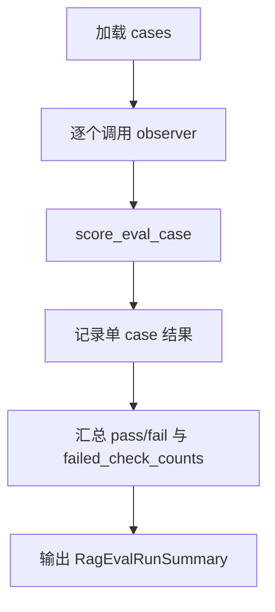

# RAG Eval Runner Spec

> 分类：后端（Backend）

## 1. 功能目标

在已有 fixture + scorer 基础上，新增一个可执行的 RAG eval runner，支持批量跑 case、汇总通过率与失败原因，为后续接真实链路回放脚本或 CI 回归提供统一入口。

## 2. 依赖模块

- `rag_eval_service` — 负责 case 加载与单 case 打分
- `rag_eval_fixtures` — 提供版本化 case 数据

## 3. 用户流程

1. 开发者加载本地 fixture。
2. 开发者提供一个 `observer(case)`，返回链路观察结果。
3. runner 逐个执行 case，产出单 case 结果。
4. runner 汇总：
   - 通过数
   - 失败数
   - 通过率
   - 失败检查分布

## 4. API 设计

新增内部接口：

- `run_eval_cases(cases, observer) -> RagEvalRunSummary`

说明：

- `observer` 可为同步或异步调用方后续适配，本期先实现同步接口

## 5. 数据结构

### 单 case 结果

- `case_id: str`
- `category: str`
- `passed: bool`
- `failed_checks: list[str]`

### 运行汇总

- `total_cases: int`
- `passed_cases: int`
- `failed_cases: int`
- `pass_rate: float`
- `failed_check_counts: dict[str, int]`
- `results: list[RagEvalCaseResult]`

## 6. 核心处理规则

- runner 顺序执行全部 case
- 每个 case 都必须记录结果
- `pass_rate = passed_cases / total_cases`
- `failed_check_counts` 按检查项累加
- runner 自身不决定链路实现，只依赖 `observer(case)` 返回 `RagEvalObserved`

## 7. 边界情况

- `cases` 为空：返回 `total_cases=0`，`pass_rate=0.0`
- `observer` 抛错：将该 case 记为失败，`failed_checks=["observer_error"]`
- 同一 case 有多个失败检查：全部计入分布

## 8. 错误处理

- runner 不抛出单 case 错误，统一转为失败结果
- fixture 加载失败：沿用 fixture 层测试失败

## 9. 测试点

### 服务层

- 全部通过时汇总正确
- 部分失败时 `failed_check_counts` 正确
- observer 抛错时 case 记为失败
- 空 case 列表时返回空汇总

## 10. 验收 checklist

- [x] 存在批量执行 RAG eval case 的统一 runner
- [x] runner 能输出通过率与失败原因分布
- [x] observer 抛错不会中断整轮评测
- [x] 新增测试通过

---

## 流程图

