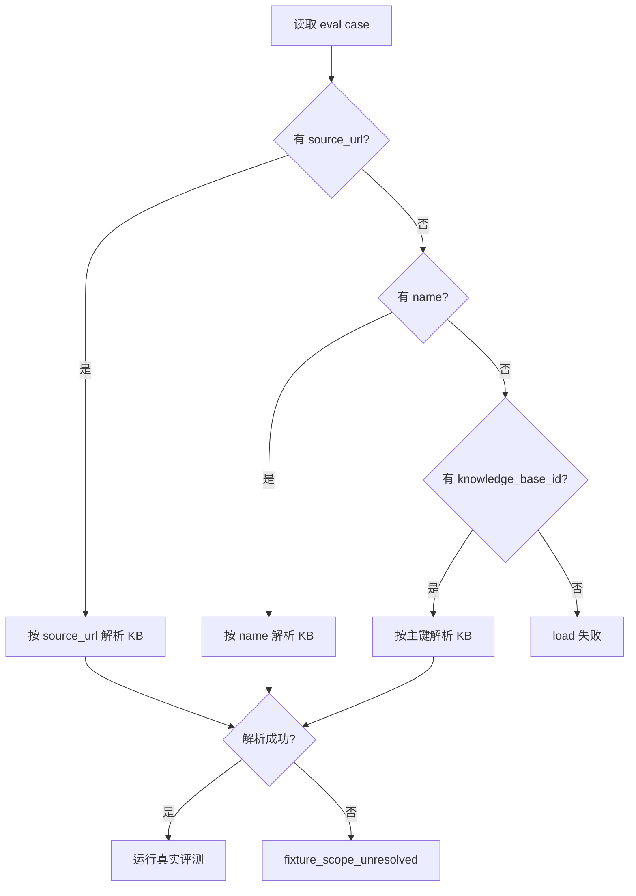

# RAG Eval Scope Resolution Spec

> 分类：后端（Backend）

## 1. 功能目标

解决真实链路评测 fixture 依赖硬编码 `knowledge_base_id` 的问题，使评测 case 能通过稳定标识解析到当前数据库中的真实知识库，避免因本地/测试环境主键不同导致整轮评测失真。

## 2. 背景问题

当前 `rag_eval_cases.json` 直接写 `knowledge_base_id`。真实评测脚本在不同数据库环境运行时，这些 ID 往往不是预期文档，导致：

- `knowledge_scope_match` 全量失败
- 后续 `mode_match / answer_match / citation_match` 结果失去解释价值

## 3. 依赖模块

- `rag_eval_service` — fixture 读取与打分
- `rag_real_chain_eval_service` — 真实知识库解析
- `knowledge_repository` — 查询知识库

## 4. 数据结构

`RagEvalCase` 增加可选字段：

- `knowledge_base_id: int | None`
- `knowledge_base_name: str | None`
- `knowledge_base_source_url: str | None`

解析优先级：

1. `knowledge_base_source_url`
2. `knowledge_base_name`
3. `knowledge_base_id`

至少需要提供一种 scope 标识。

## 5. 核心处理规则

- 优先使用 `source_url` 解析真实知识库
- `source_url` 未提供时，可退回到 `name`
- `name` 未提供时，再退回到 `knowledge_base_id`
- 若多种标识同时提供，`source_url` / `name` 解析成功后，不再依赖 fixture 中的旧 ID
- 若无法解析到知识库，返回 `fixture_scope_unresolved`
- 评分中的 `knowledge_scope_match` 应基于“解析后的预期知识库 ID”判断，而不是仅比较 fixture 原始字段

## 6. 边界情况

- `source_url` 对应 0 条记录：视为未解析
- `name` 对应多条记录：取最近更新的一条
- 仅提供旧 `knowledge_base_id`：继续兼容
- 三种字段都缺失：fixture 非法，应在加载阶段失败

## 7. 错误处理

- fixture 缺少 scope 标识：`load_eval_cases` 抛 `ValueError`
- real-chain 解析不到知识库：返回 `outcome=error`，`error_code=fixture_scope_unresolved`
- 单 case 失败不应中断整轮评测

## 8. 测试点

### 服务层

- loader 支持读取新增可选字段
- loader 在 scope 全缺失时抛错
- score 使用解析后的 expected knowledge base id 判断 scope
- observer 优先按 `source_url` 解析
- observer 解析不到时返回 `fixture_scope_unresolved`

## 9. 验收 checklist

- [x] fixture 支持 `knowledge_base_source_url`
- [x] fixture 仍兼容旧 `knowledge_base_id`
- [x] real-chain eval 不再依赖固定本地主键
- [x] scope 解析失败有明确错误码
- [x] 新增测试通过

---

## 流程图

