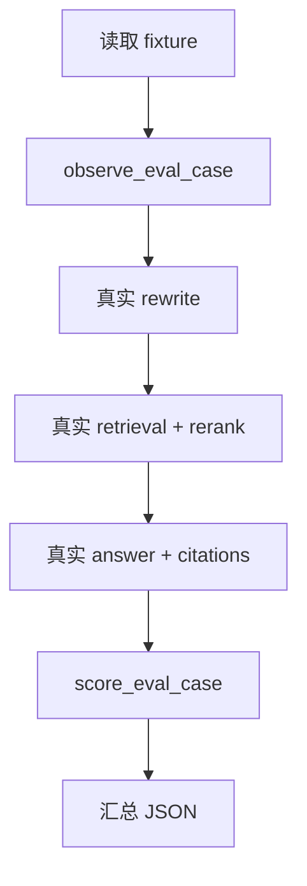

# RAG Real Chain Eval Spec

> 分类：后端（Backend）

## 1. 功能目标

在已有 `rag_eval_fixtures` 与 `rag_eval_runner` 基础上，新增一个可连接真实数据库和真实模型调用的评测 adapter / runner script，直接复用当前 QA 主链路的 query rewrite、hybrid retrieval、rerank、answer 生成与 citations 提取，输出真实链路评测结果。

## 2. 依赖模块

- `qa_service` — 提供真实 query rewrite、混合检索、rerank、prompt、citations 逻辑
- `rag_eval_service` — 提供 case 加载、单 case 打分、汇总 runner
- `db.session` — 提供数据库会话
- `knowledge_repository` — 校验知识库存在且为 `done`

## 3. 用户流程

1. 开发者执行本地脚本。
2. 脚本读取 fixture 文件。
3. 对每个 case：
   - 校验知识库
   - 运行真实 rewrite
   - 运行真实 retrieval / rerank
   - 调用真实回答生成
   - 提取 citations
4. 结果映射为 `RagEvalObserved`
5. 交给现有 runner 打分并输出汇总 JSON。

## 4. API 设计

不新增 HTTP API。

新增内部接口：

- `observe_eval_case(db, case) -> RagEvalObserved`
- `run_real_chain_eval(path) -> RagEvalRunSummary`

新增本地脚本：

- `backend/scripts/run_rag_eval.py`

## 5. 数据结构

沿用现有：

- `RagEvalCase`
- `RagEvalObserved`
- `RagEvalRunSummary`

## 6. 核心处理规则

- 真实链路评测不写入 conversations / messages
- history 直接来自 fixture，不依赖真实会话表
- 若知识库不存在或状态非 `done`，返回 `outcome=error`
- retrieval query 取真实 rewrite 输出
- 若无候选或 rerank 后为空，返回拒答观察结果
- 若生成成功但 citations 为空，返回 `missing_citations`
- 最终汇总走现有 runner

## 7. 边界情况

- fixture 中 `knowledge_base_id` 无效：case 失败
- 外部模型调用失败：该 case 失败并记录 `observer_error`
- retrieval 空：返回拒答观察结果
- answer 空：视为失败

## 8. 错误处理

- 单 case 失败不应中断整轮评测
- 脚本异常退出时返回非 0

## 9. 测试点

### 服务层

- async runner 可处理 async observer
- adapter 能把历史 turn 转成 rewrite / prompt 所需消息
- observer 异常不会中断整轮汇总

### 回归

- 不影响现有 QA 正常链路
- 不影响现有 fixture / runner 单测

## 10. 验收 checklist

- [x] 存在真实链路评测 adapter
- [x] 存在可执行脚本输出汇总 JSON
- [x] 单 case 失败不会中断整轮评测
- [x] 新增测试通过

---

## 流程图

