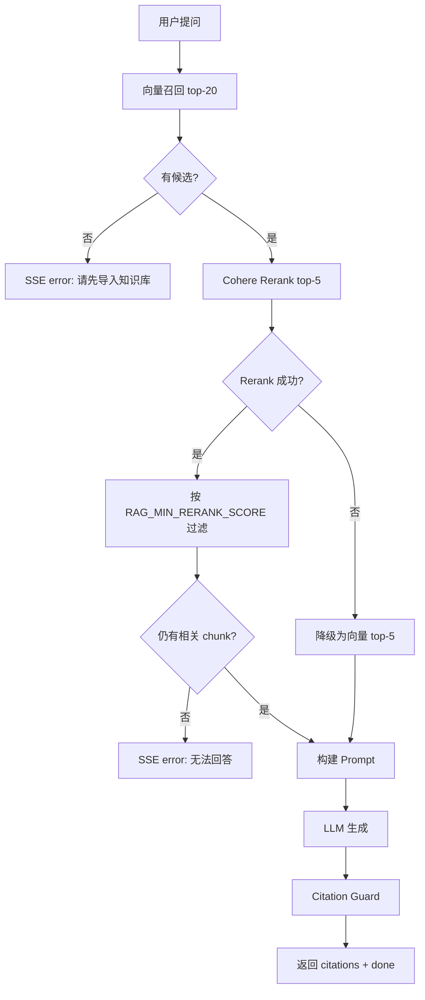

# RAG Relevance Threshold Spec

> 分类：后端（Backend）

## 1. 功能目标

为 QA 检索结果增加相关性阈值，避免“只要检索到 top chunks 就强行生成答案”。当 rerank 后没有足够相关的 chunk 时，系统应拒答并明确说明现有文档无法回答。

## 2. 依赖模块

- `qa_service` — 向量召回、Cohere Rerank、Prompt 构建、SSE 输出
- `core.config` — 新增 RAG 阈值环境变量
- `DocumentChunk` — 被检索和引用的上下文来源

## 3. 用户流程

1. 用户提交问题。
2. 后端向量召回 top-20 chunks。
3. Cohere Rerank 对候选 chunks 排序并返回相关性分数。
4. 后端过滤低于阈值的 rerank 结果。
5. 若过滤后没有候选 chunk，SSE 返回“根据已有文档，无法回答该问题”。
6. 若仍有候选 chunk，继续构建 prompt、生成答案、校验 citations。

## 4. API 设计

沿用现有接口：

### POST /api/v1/qa/conversations/{conv_id}/ask

相关性不足 SSE：

```json
{"type": "error", "message": "根据已有文档，无法回答该问题"}
```

## 5. 数据结构

不新增表，不新增字段。

新增环境变量：

- `RAG_MIN_RERANK_SCORE: float` — rerank 最低相关性分数，默认 `0.15`

## 6. 核心处理规则

- 向量召回仍取 top-20。
- Cohere Rerank 仍取 top-5。
- Rerank 成功时，只保留 `relevance_score >= RAG_MIN_RERANK_SCORE` 的结果。
- 过滤后为空时：
  - 不调用 LLM
  - 不写入 user / assistant message
  - SSE 返回无法回答错误
- Rerank API 失败时沿用现有降级策略，本 feature 不改变“降级为向量 top-5”的既有行为。

## 7. 边界情况

- 没有向量候选：沿用“请先导入知识库”。
- Rerank 返回空结果：返回“根据已有文档，无法回答该问题”。
- Rerank 返回部分低分、部分高分：只使用高分 chunks。
- 环境变量设置为 `0`：关闭相关性过滤。
- 环境变量设置过高：可能增加拒答率，需要用测试集调参。

## 8. 错误处理

- 参数错误：返回 422。
- 对话无权限：SSE error，沿用现有逻辑。
- 无相关内容：SSE error，不生成答案。
- Rerank API 失败：沿用既有降级策略。

## 9. 测试点

### 服务层

- 高于阈值的 rerank 结果会被保留。
- 低于阈值的 rerank 结果会被过滤。
- 混合高低分时只保留高分结果。
- 全部低分时返回空候选。

### API

- rerank 后无相关候选时 SSE 返回无法回答错误。

### 回归

- 不影响已有 citations guard。
- 不影响 rerank 失败降级行为。

## 10. 验收 checklist

- [x] 支持通过环境变量配置 rerank 最低相关性分数
- [x] 低相关 chunks 不会进入 prompt
- [x] 全部低相关时不调用 LLM
- [x] 全部低相关时不写入 messages
- [x] 新增服务层测试通过
- [x] 不影响已有 citation guard 测试

---

## 流程图


