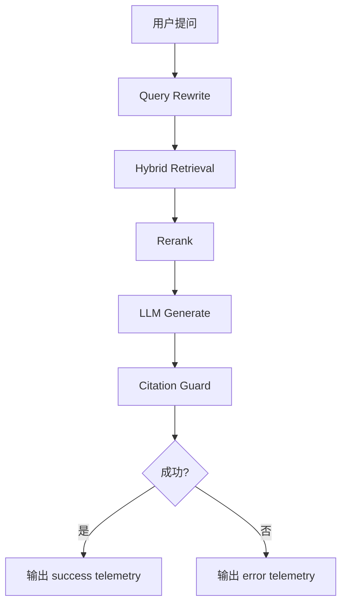

# RAG Telemetry Spec

> 分类：后端（Backend）

## 1. 功能目标

为 QA RAG 链路增加结构化 telemetry 日志，记录检索、query rewrite、rerank、citations 和生成耗时等关键信号，便于定位“搜不到、搜错了、引用缺失、延迟高”的具体环节。

## 2. 依赖模块

- `qa_service` — 问答主链路，负责产生 telemetry 数据
- `core.logging` — 统一日志输出
- `core.config` — telemetry 开关配置

## 3. 用户流程

1. 用户提问。
2. 后端执行 query rewrite、混合检索、rerank、生成、citation guard。
3. 在请求结束时输出一条结构化 telemetry 日志。
4. 若中途失败，也输出一条带错误码的 telemetry 日志。

## 4. API 设计

不新增 API，不改变 SSE 契约。

## 5. 数据结构

不新增表，不新增业务字段。

新增环境变量：

- `RAG_TELEMETRY_ENABLED: bool` — 是否开启 telemetry 日志，默认 `true`

日志字段建议：

- `event`
- `conversation_id`
- `knowledge_base_id`
- `question_length`
- `retrieval_query_length`
- `retrieval_query_rewritten`
- `vector_candidates_count`
- `fts_candidates_count`
- `merged_candidates_count`
- `rerank_candidates_count`
- `citations_count`
- `rewrite_duration_ms`
- `vector_duration_ms`
- `fts_duration_ms`
- `rerank_duration_ms`
- `generation_duration_ms`
- `total_duration_ms`
- `outcome`
- `error_code`

## 6. 核心处理规则

- 每次 QA 请求在终止时最多输出一条 telemetry 日志。
- 成功请求记录 `outcome=success`。
- 失败请求记录 `outcome=error` 与 `error_code`。
- 不记录完整用户问题、完整 rewrite query、完整答案正文，避免日志泄露内容。
- telemetry 失败不影响主链路。

## 7. 边界情况

- rewrite 关闭：`retrieval_query_rewritten=false`
- FTS 异常降级：`fts_candidates_count=0`，但仍记录 `outcome`
- 无相关内容拒答：记录 `error_code=no_relevant_context`
- citations 缺失：记录 `error_code=missing_citations`

## 8. 错误处理

- telemetry 写日志异常：静默忽略
- 主链路错误：沿用现有 SSE error

## 9. 测试点

### 服务层

- telemetry payload 包含关键计数与耗时字段
- telemetry payload 不包含原始问题正文
- rewrite 命中时 `retrieval_query_rewritten=true`
- 失败路径可带 `error_code`

### 回归

- 不影响现有 QA SSE 事件
- 不影响 citation guard、hybrid retrieval、query rewrite

## 10. 验收 checklist

- [x] QA 主链路支持结构化 telemetry 日志
- [x] 成功与失败路径都会产生日志
- [x] 日志包含召回计数、耗时、citations 数
- [x] 日志不包含完整问题和答案正文
- [x] 新增服务层测试通过

---

## 流程图

