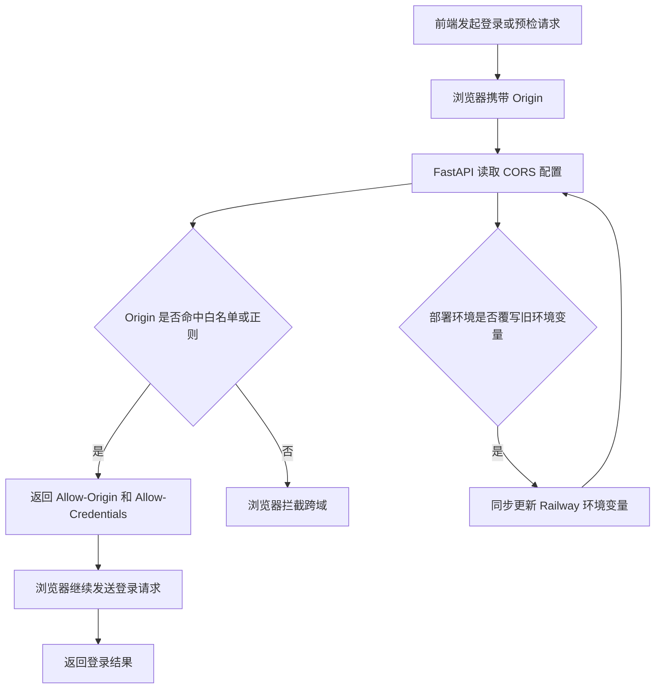

# Auth CORS Origin Spec

## 1. 功能目标

修复生产前端 `https://offer-copilot-frontend.vercel.app` 调用后端鉴权接口 `/api/v1/auth/login` 时的跨域失败问题，确保浏览器预检请求和携带凭证的登录请求都能通过。

## 2. 依赖模块

- `backend.app.core.config`：读取并解析 CORS 相关环境变量
- `backend.app.main`：注册 FastAPI CORS 中间件
- `backend/.env.example`：提供部署配置示例

## 3. 用户流程

1. 用户打开 Vercel 生产前端登录页。
2. 前端向 Railway 后端发送 `POST /api/v1/auth/login`，浏览器先发起 `OPTIONS` 预检请求。
3. 后端识别请求来源命中白名单或正则规则，返回允许跨域和允许凭证的响应头。
4. 浏览器继续发送登录请求，前端正常收到登录结果。

## 4. API 设计

本次不新增 API，也不修改鉴权接口入参/出参。

涉及接口：

- `POST /api/v1/auth/login`
- `OPTIONS /api/v1/auth/login`

## 5. 数据结构

本次无数据库结构变更。

新增配置：

- `BACKEND_CORS_ORIGINS: str` — 逗号分隔的明确来源白名单
- `BACKEND_CORS_ORIGIN_REGEX: str | None` — 可选的来源正则，用于 Vercel 预览域名等动态来源

## 6. 核心处理规则

- 后端必须继续通过环境变量驱动 CORS，不允许硬编码 secret 或绕过配置层。
- 默认白名单需要覆盖本地开发地址和生产前端地址。
- 如果配置了 `BACKEND_CORS_ORIGIN_REGEX`，后端应把它传递给 `CORSMiddleware`。
- `allow_credentials=True` 必须保留，因为前端请求显式使用了 `credentials: "include"`。

## 7. 边界情况

- 来源为本地开发地址时，现有联调流程不受影响。
- 来源为生产 Vercel 域名时，应直接命中白名单。
- 来源为 Vercel 预览域名时，只有在显式配置正则后才允许通过。
- 空字符串、首尾空格等无效来源配置应被自动过滤。

## 8. 错误处理

- 若部署环境仍显式把 `BACKEND_CORS_ORIGINS` 配成旧值，生产环境仍会跨域；需要在部署平台同步更新环境变量。
- 若 `BACKEND_CORS_ORIGIN_REGEX` 配置非法，Starlette 将无法按预期匹配来源；测试需覆盖配置透传逻辑。

## 9. 测试点

### API

- CORS 中间件配置包含生产前端域名
- 配置正则时，中间件参数正确透传

### 配置

- `BACKEND_CORS_ORIGINS` 能正确解析逗号分隔字符串并去除空项
- 默认值包含本地和生产前端来源

### 回归

- 不影响现有本地开发跨域配置
- 不修改现有鉴权接口协议

## 10. 验收 checklist

- [ ] 生产前端来源被纳入后端 CORS 白名单
- [ ] 可选正则来源配置可被中间件消费
- [ ] 新增测试全部通过
- [ ] 不影响本地开发联调
- [ ] 无数据库变更

## 11. Design

- 数据流：浏览器 `Origin` 请求头 -> `Settings` 解析环境变量 -> `main` 组装 CORS 中间件参数 -> Starlette 根据来源返回跨域响应头。
- 与现有模块关系：只调整配置层与应用启动层，不触碰 `api/`、`services/`、`tasks/`、`models/`。

## 12. Plan

1. 更新 `backend.app.core.config`，补充生产域名默认值与可选正则配置。
2. 更新 `backend.app.main`，把 CORS 参数组装提炼为可测试函数并接入正则。
3. 更新 `backend/.env.example`，补充生产部署示例。
4. 新增后端测试，覆盖默认来源解析与 CORS 参数生成。
5. 运行相关测试并复核是否符合本 spec。

---

## 流程图

