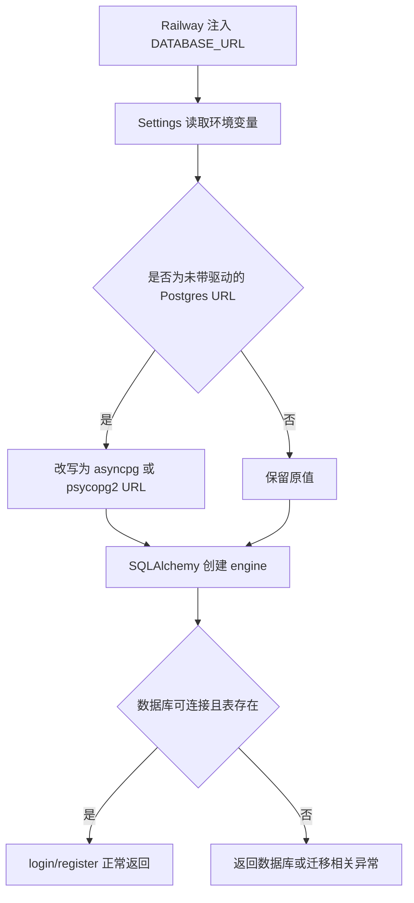

# Auth Railway Runtime Env Spec

## 1. 功能目标

修复 Railway 生产环境下鉴权接口因数据库连接串驱动不兼容导致的 `500`，确保 `POST /api/v1/auth/login` 和 `POST /api/v1/auth/register` 在直接引用 Railway 提供的 Postgres 变量时也能正常工作。

## 2. 依赖模块

- `backend.app.core.config`：统一读取并规范化运行时环境变量
- `backend.app.db.session`：创建 FastAPI 使用的异步 SQLAlchemy engine
- `backend.alembic.env`：使用同步驱动连接串执行迁移
- `backend/.env.example`：提供部署示例

## 3. 用户流程

1. 开发者在 Railway 后端服务中直接引用 Postgres 服务提供的 `DATABASE_URL`。
2. 后端启动时读取环境变量。
3. 配置层识别到连接串缺少异步/迁移所需驱动前缀并自动规范化。
4. 登录或注册请求访问数据库。
5. 后端正常查询 `users` 表并写入 `auth_sessions`，返回鉴权结果。

## 4. API 设计

本次不新增 API，也不修改以下接口协议：

- `POST /api/v1/auth/login`
- `POST /api/v1/auth/register`

## 5. 数据结构

本次无数据库表结构变更。

涉及运行时配置：

- `DATABASE_URL: str` — API / worker 运行时数据库连接串，最终需规范为 `postgresql+asyncpg://...`
- `ALEMBIC_DATABASE_URL: str` — 迁移使用的连接串，最终需规范为 `postgresql+psycopg2://...`

## 6. 核心处理规则

- 配置层必须继续以环境变量为唯一来源，不允许硬编码线上数据库地址。
- 当 `DATABASE_URL` 为 `postgres://...` 或 `postgresql://...` 且未显式指定驱动时，自动转为 `postgresql+asyncpg://...`。
- 当 `ALEMBIC_DATABASE_URL` 为 `postgres://...` 或 `postgresql://...` 且未显式指定驱动时，自动转为 `postgresql+psycopg2://...`。
- 如果调用方已经显式传入 `postgresql+asyncpg://...` 或 `postgresql+psycopg2://...`，配置层不得重复改写。
- 本次不改动 auth service、repository、model 逻辑。

## 7. 边界情况

- Railway 返回 `postgres://` 短前缀时，应同样被兼容。
- 本地开发 `.env` 已经是带驱动前缀的 URL 时，不应受影响。
- 若环境变量为空或不是 Postgres 连接串，本次不尝试猜测修复，保持原值交给运行时报错。

## 8. 错误处理

- 若数据库账号、密码、主机或库名错误，运行时仍会返回数据库连接异常；本次仅修复驱动前缀不兼容问题。
- 若数据库缺少迁移表结构，鉴权接口仍可能失败；需要单独执行 Alembic 迁移。

## 9. 测试点

### 配置

- `DATABASE_URL=postgresql://...` 时自动转为 `postgresql+asyncpg://...`
- `DATABASE_URL=postgres://...` 时自动转为 `postgresql+asyncpg://...`
- `ALEMBIC_DATABASE_URL=postgresql://...` 时自动转为 `postgresql+psycopg2://...`
- 已带驱动前缀的 URL 保持不变

### 回归

- 不影响现有 CORS 配置测试
- 不修改 auth 接口协议

## 10. 验收 checklist

- [ ] Railway 普通 Postgres URL 可被后端运行时自动兼容
- [ ] Alembic 连接串仍可正常使用同步驱动
- [ ] 新增测试全部通过
- [ ] 不影响本地开发环境
- [ ] 无数据库 schema 变更

## 11. Design

- 数据流：Railway 环境变量 -> `Settings` 字段校验/规范化 -> FastAPI / Alembic 读取规范化后的连接串 -> SQLAlchemy 选择正确驱动。
- 与现有模块关系：仅调整配置层，不触碰 `api/`、`services/`、`tasks/`、`models/` 的业务逻辑。

## 12. Plan

1. 在 `backend.app.core.config` 增加 Postgres URL 规范化逻辑。
2. 在 `backend/.env.example` 补充 Railway 部署说明，避免后续误配。
3. 在 `backend/tests/test_cors_config.py` 增加连接串规范化测试。
4. 运行后端相关测试并复核本 spec。

---

## 流程图

