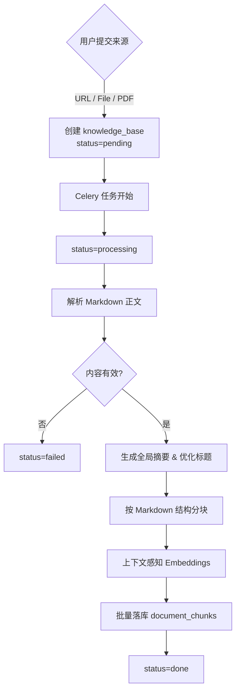

# Knowledge Ingestion Spec

> 分类：后端（Backend）

## 1. 背景与目标

### 1.1 功能目标

用户提交技术文档 URL 或上传文档文件后，系统异步获取文档内容，切分为结构完整的 chunk，生成 embedding，并存入 PostgreSQL（pgvector）中。同时生成**知识库全局摘要**，供后续意图路由和宏观问答使用。

### 1.2 范围

- 本期支持 URL 文档接入
- 本期支持 UTF-8 编码的 Markdown / TXT 文件上传接入
- 本期支持 PDF 文件接入
- 目标是保证知识库入库结果能支撑后续可追溯问答、自动路由与宏观问答

### 1.3 非目标

- 不实现二进制文件解析（如 docx / pptx / epub）
- 不在入库阶段做回答级评测

## 2. 用户流程

1. 用户提交技术文档 URL，或上传支持的文档文件（`.md`, `.txt`, `.pdf`）。
2. 系统创建 `knowledge_base` 记录，返回 `knowledge_base_id` 与 `task_id`。
3. Celery 任务执行：
   - 获取原始文本（Firecrawl 抓取 Markdown 或直接读取文件/解析 PDF）。
   - **生成全局摘要**并存储。
   - 后端根据正文生成更合适的知识库标题。
   - 系统按 Markdown 标题切分，再做结构感知二次分块。
   - 系统批量生成 embeddings（上下文感知）。
   - 系统将 chunk、metadata、embedding 写入 `document_chunks`。
4. 用户查看 `done` 状态及摘要。

## 3. API 设计

### POST /api/v1/knowledge

请求体：

- `name: string | null`
- `source_url: string`

响应：

- `knowledge_base_id: string`
- `task_id: string`
- `status: "pending"`

### POST /api/v1/knowledge/upload

请求体：

- `file: UploadFile`
- `name: string | null`

约束：

- 支持 `.md` / `.txt` / `.pdf`
- 上传内容不得通过 Celery 消息体直接传完整正文。

### GET /api/v1/knowledge

响应（列表）中包含 `summary: string | null`。

### DELETE /api/v1/knowledge/{id}

仅允许删除当前登录用户自己的 `done/failed` 知识库。

## 4. 数据结构

### 4.1 knowledge_bases

- `id`
- `user_id`
- `name`
- `summary` (NEW) — 由 LLM 生成的 300-500 字全局摘要
- `source_type`
- `source_url`
- `status`
- `error_message`
- `created_at`
- `updated_at`

### 4.2 document_chunks

- `id`
- `knowledge_base_id`
- `content`
- `embedding`（`Vector(1536)`）
- `source_url`
- `heading_path`
- `chunk_index`
- `created_at`

## 5. 核心处理规则

### 5.1 抓取与解析

- **URL**: Firecrawl 获取 Markdown。
- **PDF**: 使用 PyMuPDF (fitz) 解析为文本。
- **Markdown/TXT**: 直接读取。

### 5.2 标题与摘要生成

#### 5.2.1 全局摘要生成 (NEW)
- 提取正文前 10,000 个字符。
- 使用 `gpt-4o-mini` 生成 300-500 字摘要。
- 摘要必须涵盖核心观点、适用场景和关键结论。
- 摘要生成失败不阻断主链路。

#### 5.2.2 标题生成
- 抓取成功后根据 Markdown 正文生成更准确标题。

### 5.3 Chunking

- 第一层：按 Markdown 标题递归拆分。
- 第二层：对每个标题段做结构感知分块，优先保留代码块、表格、列表。

### 5.4 Embedding

- 使用 `text-embedding-3-small`。
- 上下文感知：在生成向量前拼接 `章节路径: {heading_path}\n内容: {content}`。

## 6. 边界情况

- 内容为空、解析失败、超限等均将状态置为 `failed`。
- 重复 URL 允许重复创建。

## 9. 验收标准

- [x] 提交 URL/文件后能完成入库
- [x] **生成并存储知识库全局摘要**
- [x] 支持 PDF 解析
- [x] 代码块 / 表格 / 列表块不会被二次切坏
- [x] 数据可供向量 + FTS 检索使用

---

## 10. 流程图

