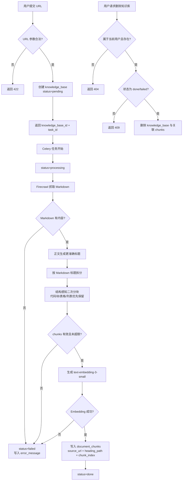

# Knowledge Ingestion Spec

> 分类：后端（Backend）

## 1. 背景与目标

### 1.1 功能目标

用户提交技术文档 URL 后，系统异步抓取文档内容，切分为结构完整的 chunk，生成 embedding，并存入 PostgreSQL（pgvector）中，供后续问答检索使用。

### 1.2 范围

- 本期支持 URL 文档接入
- 目标是保证知识库入库结果能支撑后续可追溯问答

### 1.3 非目标

- 不实现 PDF 上传
- 不在入库阶段做问答生成
- 不在入库阶段做 query rewrite 或回答级评测

## 2. 用户流程

1. 用户提交技术文档 URL
2. 系统创建 `knowledge_base` 记录，返回 `knowledge_base_id` 与 `task_id`
3. Celery 任务调用 Firecrawl 抓取 Markdown
4. 后端根据正文生成更合适的知识库标题（失败不阻断主链路）
5. 系统按 Markdown 标题切分，再做结构感知二次分块
6. 系统批量生成 embeddings
7. 系统将 chunk、metadata、embedding 写入 `document_chunks`
8. 用户通过状态接口或列表接口查看 `pending / processing / done / failed`

## 3. API 设计

### POST /api/v1/knowledge

请求体：

- `name: string | null`
- `source_url: string`

响应：

- `knowledge_base_id: string`
- `task_id: string`
- `status: "pending"`

说明：

- `name` 可选；为空时先根据 URL 生成默认名，抓取正文后可再回写更准确标题
- 允许重复提交同一 URL，不做去重

### GET /api/v1/knowledge/{id}/status

响应：

- `knowledge_base_id: string`
- `status: "pending" | "processing" | "done" | "failed"`
- `error_message: string | null`

### GET /api/v1/knowledge

响应（列表）：

- `knowledge_base_id: string`
- `name: string`
- `source_url: string`
- `status: "pending" | "processing" | "done" | "failed"`
- `error_message: string | null`
- `created_at: datetime`
- `updated_at: datetime`

约束：

- 仅返回当前登录用户的数据

### DELETE /api/v1/knowledge/{id}

响应：

- 成功删除返回空响应

约束：

- 仅允许删除当前登录用户的数据
- 仅允许删除 `done` / `failed` 状态的知识库
- `pending` / `processing` 状态删除返回 `409`
- 不存在或不属于当前用户返回 `404`

## 4. 数据结构

### 4.1 knowledge_bases

- `id`
- `user_id`
- `name`
- `source_type`
- `source_url`
- `status`
- `error_message`
- `created_at`
- `updated_at`

说明：

- `user_id` 不可为空
- `status` 既持久化在数据库，也同步写入 Redis

### 4.2 document_chunks

- `id`
- `knowledge_base_id`
- `content`
- `embedding`（`Vector(1536)`）
- `source_url`
- `heading_path`
- `chunk_index`
- `token_count`（可选）
- `created_at`

每个 chunk 必须携带 metadata：

- `source_url`
- `heading_path`
- `chunk_index`

数据库索引：

- `ix_document_chunks_embedding` — pgvector ivfflat
- `ix_document_chunks_content_fts` — GIN FTS index on `content`

## 5. 核心处理规则

### 5.1 抓取

- 使用 Firecrawl 获取网页正文
- 输出格式为 Markdown
- 若抓取结果为空，任务失败

### 5.2 标题生成

- 抓取成功后可根据 Markdown 正文生成更准确标题
- 标题生成失败不影响主入库链路

### 5.3 Chunking

第一层：

- 按 Markdown 标题递归拆分

第二层：

- 对每个标题段做结构感知分块
- 优先整体保留以下原子结构：
  - fenced code block
  - Markdown table
  - Markdown list block
- 普通文本再按 `chunk_size = 512`、`chunk_overlap = 64` 切分

说明：

- 目标是避免代码块、表格、列表等技术结构被二次切断
- `heading_path` 必须保留
- `chunk_index` 必须连续递增

### 5.4 Embedding

- 使用 `text-embedding-3-small`
- 批量处理，`batch_size = 100`

### 5.5 存储

- 向量写入 PostgreSQL pgvector
- 全文检索依赖 `content` 的 GIN FTS index
- 所有 schema 变更必须通过 Alembic

### 5.6 任务状态

Redis：

- `task:{task_id}:status = pending | processing | done | failed`

数据库：

- `knowledge_bases.status` 同步更新

状态流转：

- 创建任务后：`pending`
- 开始抓取或索引：`processing`
- 全部完成：`done`
- 任一步骤失败：`failed`

## 6. 边界情况

- URL 非法
- URL 可访问但正文为空
- Firecrawl 抓取失败
- Markdown 解析后无有效 chunk
- Embedding API 失败
- 数据库写入失败
- 重复提交同一 URL
- 超长文档导致 chunk 数量过多
- 代码块未闭合
- 表格格式不完整
- 删除不存在的知识库
- 删除其他用户的知识库
- 删除 `pending` / `processing` 中的知识库

策略：

- 重复 URL：允许重复创建
- 结构识别异常：回退到普通文本切分，不中断任务
- chunk 总数超过 `MAX_CHUNKS`：任务失败
- `pending` / `processing` 知识库：本期不可删除，不做任务取消

## 7. 错误处理

- 接口参数错误：直接返回 4xx
- 异步任务失败：状态置为 `failed`
- `error_message` 保存失败摘要
- 单个知识库任务失败不影响其他任务

## 8. 测试点

### API

- 成功创建 knowledge base
- 非法 URL 返回校验错误
- 仅返回当前用户知识库
- 成功删除 `done` / `failed` 知识库
- 删除不存在知识库返回 `404`
- 删除 `pending` / `processing` 知识库返回 `409`
- 删除其他用户知识库返回 `404`

### 任务

- 状态从 `pending -> processing -> done`
- 抓取失败后状态变为 `failed`

### 数据

- `document_chunks` 正确入库
- 每个 chunk 均带 `source_url / heading_path / chunk_index`
- embedding 维度为 1536

### Chunking

- fenced code block 不被二次切断
- Markdown table 不被二次切断
- list block 不被二次切断
- 普通长文本仍按 `512/64` 切分

### 回归

- 不影响现有 `auth` / `users` / `knowledge` 模块

## 9. 验收标准

- [x] 提交 URL 后能创建知识库任务
- [x] 创建接口返回 `knowledge_base_id`、`task_id`、`status`
- [x] 知识库列表接口只返回当前用户数据
- [x] 后台能完成抓取、chunk、embedding、入库
- [x] chunk metadata 完整
- [x] 代码块 / 表格 / 列表块不会被二次切坏
- [x] 数据可供 vector + FTS 检索使用
- [ ] 仅允许删除当前用户自己的 `done/failed` 知识库
- [ ] 删除 `pending/processing` 知识库返回 `409`

---

## 10. 流程图

正式图片：

