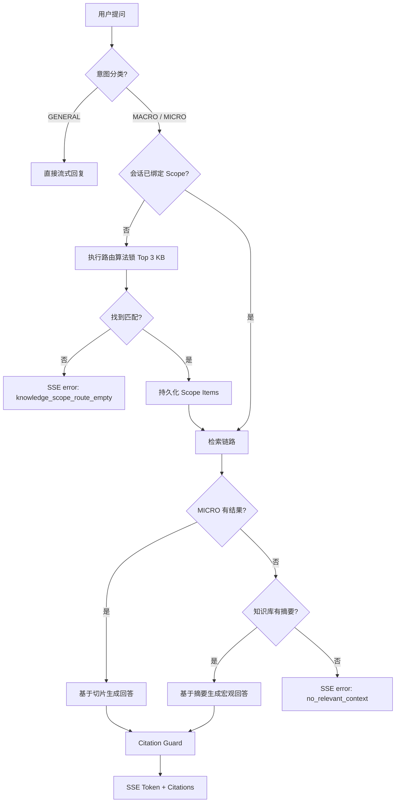

# QA（问答）Spec

> 分类：后端（Backend）

## 1. 功能目标

为用户提供基于已导入技术文档知识库的多轮问答能力。系统必须保证：

- **自动化知识路由**：根据用户问题自动识别并锁定相关知识库范围（Scope），支持 Top 3 知识库并行检索。
- **检索范围受限**：检索范围受当前会话绑定的知识范围（Scope Items）约束，支持会话级隔离。
- **意图分类**：识别闲聊（GENERAL）、宏观总结（MACRO）与微观细节（MICRO）意图，采取不同的回答策略。
- **延迟路由**：支持在首个检索类问题时触发路由，而非必须在创建会话时指定。
- **宏观问答兜底**：支持基于知识库全局摘要（Summary）回答宏观问题，避免切片检索为空时直接拒答。
- **引用追溯**：答案必须附带可追溯到具体切片或知识库的 citations，包含知识库名称。
- **流式响应**：问答通过 SSE 流式返回。

## 2. 依赖模块

- `auth` — 所有 QA 接口需登录
- `knowledge_base` — 已导入文档、`DocumentChunk` 及全局摘要
- `embedding_service` — 问题向量化及语义路由计算
- `qa_repository` — conversations / scope_items / messages 持久化
- `Cohere Rerank` — 候选 chunk 重排序
- `OpenAI gpt-4o` — 流式生成答案
- `OpenAI gpt-4o-mini` — 意图识别、query rewrite 与摘要压缩

## 3. 用户流程

1. **发起对话**：用户在 Chat 页直接提问，前端调用创建会话接口。
2. **意图识别与路由**：
   - 若意图为 `GENERAL`（闲聊），直接回复，不触发路由。
   - 若意图为检索类（`MACRO` 或 `MICRO`）：
     - 若会话未绑定 Scope，执行路由算法锁定 Top 3 相关知识库并持久化。
     - 若已绑定 Scope，在既定范围内检索。
3. **检索与生成**：
   - `MICRO_RETRIEVAL`：执行混合检索（vector + FTS）+ rerank。
   - `MACRO_RETRIEVAL`：优先利用知识库全局摘要进行回答。
4. **SSE 返回**：前端实时渲染 token；流结束前接收包含知识库名称的 citations。
5. **追问隔离**：会话后续问题将沿用已锁定的 Scope，不再重新路由。
6. **摘要压缩**：对话超过 20 条消息后，异步执行摘要压缩。

## 4. API 设计

### POST /api/v1/qa/conversations

创建新对话。支持“首问即创建”模式。

请求体：

- `question: str` — 可选，首个用户问题，用于自动路由

响应：

- `conv_id: str`
- `knowledge_scope: list[KnowledgeScopeItem]` — 自动路由的结果
- `created_at: datetime`

---

### POST /api/v1/qa/conversations/{conv_id}/ask

提问，SSE 流式返回。

请求体：

- `question: str` — 非空，最长 1000 字

SSE 事件格式：

```text
data: {"type": "token", "content": "..."}
data: {"type": "citations", "data": [...]}
data: {"type": "done"}
data: {"type": "error", "code": "...", "message": "..."}
```

错误码：

- `knowledge_scope_route_empty` — 无法路由到任何相关知识库
- `conversation_scope_unavailable` — 绑定的知识库已被删除或不可用
- `no_relevant_context` — 检索结果为空且无摘要兜底

citations 数组元素：

```json
{
  "index": 1,
  "chunk_id": "uuid",
  "knowledge_base_id": 123,
  "knowledge_base_name": "API 文档",
  "source_url": "https://...",
  "heading_path": "Installation > Redis",
  "snippet": "...",
  "is_macro": false
}
```

---

### GET /api/v1/qa/conversations/{conv_id}/messages

获取对话历史消息列表。

响应（列表）中 `citations` 结构同步包含 `knowledge_base_name`。

## 5. 数据结构

### conversations 表

- `id: UUID`
- `knowledge_base_id: int | null` — **Legacy**，仅用于兼容旧的单库模式
- `summary: text | null` — 会话历史摘要
- `message_count: int`

### conversation_knowledge_scope_items 表 (NEW)

- `id: int`
- `conversation_id: UUID` — 关联会话
- `knowledge_base_id: int` — 绑定的知识库
- `knowledge_base_name_snapshot: str` — 知识库名称快照（防删除）
- `source_url_snapshot: str` — 来源 URL 快照
- `route_score: float` — 路由匹配分数
- `position: int` — 排序位置

### messages 表

- `id: UUID`
- `citations: JSONB | null` — 包含知识库 ID 和名称

## 6. 核心处理规则

### 6.1 意图分类 (Intent Classification)

使用 `gpt-4o-mini` 将问题分类：
- `GENERAL`: 招呼、闲聊。不检索，直接生成。
- `MACRO_RETRIEVAL`: 询问全局、大纲、总结。优先使用摘要回答。
- `MICRO_RETRIEVAL`: 询问具体细节、配置、API。执行完整检索。

### 6.2 知识路由 (Scope Routing)

当检索意图触发且会话无 Scope 时：
1. 提取用户所有 `done` 状态知识库的摘要。
2. 计算问题与知识库摘要/关键词的匹配得分。
3. 选取得分最高的 Top 3 知识库作为当前会话的永久 Scope。
4. 若 Top 1 分数低于阈值，抛出 `knowledge_scope_route_empty`。

### 6.3 检索链路

1. **Query Rewrite**: 基于上下文改写为独立查询。
2. **Scope 限定**: 检索条件必须包含 `knowledge_base_id IN (scope_ids)`。
3. **混合检索**: Vector + FTS。
4. **Rerank**: Cohere 重排序。

### 6.4 宏观问答与兜底

- 若意图为 `MACRO` 或 `MICRO` 检索结果为空：
  - 检查 Scope 内知识库是否有 `summary`。
  - 若有，LLM 基于摘要回答，并生成标记为 `is_macro: true` 的知识库级别引用。

### 6.5 Citation Guard

- 验证生成内容中的 `[n]` 是否指向有效的 `DocumentChunk` 或已授权的知识库摘要。
- 只有通过验证的引用才会被返回和存储。

### 6.6 Telemetry (Observability)

QA 主链路输出结构化 telemetry 日志，至少包含：

- `retrieval_query_rewritten`: 是否重写及重写后的查询。
- `scope_size`: 绑定的知识库数量。
- `vector_candidates_count`, `fts_candidates_count`, `merged_candidates_count`, `rerank_candidates_count`.
- `citations_count`.
- **耗时分布**: `rewrite_ms`, `embedding_ms`, `vector_ms`, `fts_ms`, `rerank_ms`, `generation_ms`, `total_ms`.
- `outcome`: `success`, `error`.
- `error_code`: `no_relevant_context`, `missing_citations` 等。

### 6.7 Debug 输出

在开发调试模式下，通过 SSE 实时输出各阶段中间结果。

#### 控制开关
- 环境变量 `RAG_DEBUG_ENABLED` 全局控制。
- 只有开启且后端判定当前请求需要调试（如特定用户或调试参数）时输出。

#### 事件格式
```json
{
  "type": "debug",
  "stage": "query_rewrite|embedding|retrieval|rerank|citations",
  "timestamp": "ISO-8601",
  "trace_id": "conv-{uuid}",
  "data": {
    "description": "阶段描述",
    "unit": { "ms": "毫秒", "score": "相关性分数 (0-1)" },
    "...": "阶段特有数据"
  }
}
```

#### 关键阶段数据
1. **embedding**: 输出模型、向量维度、耗时。
2. **rerank**: 输出 Top Chunks 预览（含 `relevance_score`）。
3. **citations**: 验证通过的引用列表。


## 7. 边界情况

- **Scope 内知识库被删除**: SSE 返回 `conversation_scope_unavailable`。
- **首问是闲聊**: 创建会话，不绑定 Scope，后续第一个技术问题触发延迟路由。
- **路由无匹配**: 提示用户导入相关文档或换个问法。

## 8. 验收 checklist

- [x] 支持根据问题自动路由 Top 3 知识库
- [x] 支持延迟路由机制（非首问触发）
- [x] 意图分类正确区分闲聊、宏观、微观
- [x] 支持基于全局摘要回答宏观问题
- [x] Citations 包含知识库名称，支持宏观引用
- [x] 会话 Scope 持久化到 `conversation_knowledge_scope_items`
- [x] 兼容旧版单库会话逻辑

---

## 9. 流程图



