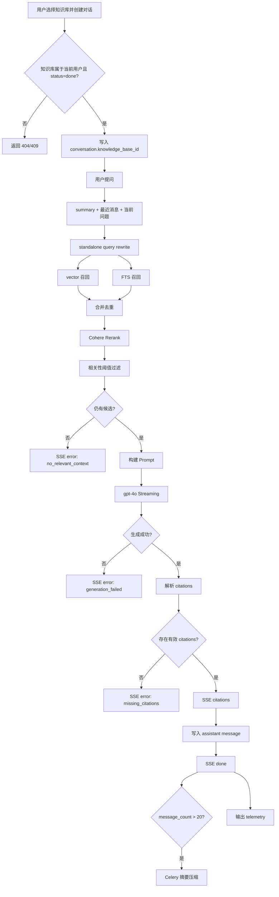

# QA（问答）Spec

> 分类：后端（Backend）

## 1. 功能目标

为用户提供基于已导入技术文档知识库的多轮问答能力。系统必须保证：

- 检索范围受当前会话绑定知识库约束
- 答案必须附带可点击 citations
- 无相关内容时拒答，不硬凑答案
- 问答通过 SSE 流式返回

## 2. 依赖模块

- `auth` — 所有 QA 接口需登录
- `knowledge_base` — 已导入文档与 `DocumentChunk`
- `embedding_service` — 问题向量化
- `qa_repository` — conversations / messages 持久化
- `Cohere Rerank` — 候选 chunk 重排序
- `OpenAI gpt-4o` — 流式生成答案
- `OpenAI gpt-4o-mini` — query rewrite 与摘要压缩

## 3. 用户流程

1. 用户先导入至少一个知识库，且索引状态为 `done`
2. 用户在 Chat 页选择一个知识库并创建新对话
3. 对话创建时写入 `knowledge_base_id`
4. 用户提问后，后端执行：
   - standalone query rewrite
   - 混合检索（vector + FTS）
   - rerank + 相关性阈值过滤
   - gpt-4o streaming
   - citations 校验
5. 前端实时渲染 token；流结束前接收 citations
6. 若缺少有效 citations 或无相关上下文，后端返回 error
7. 对话超过 20 条消息后，异步执行摘要压缩

## 4. API 设计

### POST /api/v1/qa/conversations

创建新对话。

请求体：

- `knowledge_base_id: int` — 必填，绑定单个知识库

响应：

- `conv_id: str`
- `knowledge_base_id: int`
- `created_at: datetime`

约束：

- 知识库必须存在
- 知识库必须属于当前用户
- 知识库状态必须为 `done`

---

### GET /api/v1/qa/conversations

列出当前用户所有对话。

响应（列表）：

- `conv_id: str`
- `knowledge_base_id: int | null`
- `title: str | null`
- `created_at: datetime`
- `updated_at: datetime`

说明：

- 历史未绑定会话允许返回 `knowledge_base_id = null`

---

### POST /api/v1/qa/conversations/{conv_id}/ask

提问，SSE 流式返回。

请求体：

- `question: str` — 非空，最长 1000 字

SSE 事件格式：

```text
data: {"type": "token", "content": "..."}
data: {"type": "citations", "data": [...]}
data: {"type": "done"}
data: {"type": "error", "code": "...", "message": "..."}
```

开发调试模式下可额外返回：

```text
data: {"type": "debug", "stage": "query_rewrite|retrieval|rerank|citations|terminal_error", "data": {...}}
```

说明：

- `debug` 事件仅用于开发环境调试，默认关闭
- `debug` 事件不属于前端正式依赖合同，不落库

错误码示例：

- `conversation_scope_missing`
- `no_relevant_context`
- `missing_citations`

citations 数组元素：

```json
{
  "index": 1,
  "chunk_id": "uuid",
  "source_url": "https://...",
  "heading_path": "Installation > Redis",
  "snippet": "前 200 字截断..."
}
```

---

### GET /api/v1/qa/conversations/{conv_id}/messages

获取对话历史消息列表。

响应（列表）：

- `id: str`
- `role: str`
- `content: str`
- `citations: list | null`
- `created_at: datetime`

## 5. 数据结构

### conversations 表

- `id: UUID`
- `user_id: int`
- `knowledge_base_id: int | null`
- `title: str | null`
- `summary: text | null`
- `message_count: int`
- `created_at: datetime`
- `updated_at: datetime`

说明：

- 新创建对话必须写入 `knowledge_base_id`
- 历史记录允许为空，仅用于兼容旧数据

### messages 表

- `id: UUID`
- `conversation_id: UUID`
- `role: str`
- `content: text`
- `citations: JSONB | null`
- `created_at: datetime`

citations JSONB 结构：

```json
[
  {
    "index": 1,
    "chunk_id": "uuid",
    "source_url": "https://...",
    "heading_path": "Installation > Redis",
    "snippet": "..."
  }
]
```

## 6. 核心处理规则

### 6.1 检索链路

1. 基于 `summary + 最近 4 条消息 + 当前问题` 生成 standalone retrieval query
2. 对 rewrite query 做 embedding
3. 在当前对话绑定的 `knowledge_base_id` 范围内执行：
   - pgvector top-k 召回
   - PostgreSQL FTS top-k 召回
4. 合并去重后调用 Cohere Rerank
5. 应用 `RAG_MIN_RERANK_SCORE` 过滤低相关结果
6. 若过滤后无候选，则拒答

### 6.2 Query Rewrite

- 只用于检索，不改变最终回答里的原始用户问题
- 失败或返回空字符串时回退到原问题
- 默认模型：`gpt-4o-mini`

### 6.3 Prompt 构建

```text
system: 你是技术文档助手。只基于提供的上下文回答问题。
        回答中必须用 [1]、[2] 等编号引用对应的上下文来源。
        只有当上下文与问题完全无关时，才回答"根据已有文档，无法回答该问题"。

context:
[1] {heading_path}\n{chunk_content}
[2] ...

history:
{summary（如有）}
User: ...
Assistant: ...

user: {原始用户问题}
```

### 6.4 Citation Guard

- 从最终答案解析 `[n]` 编号
- 只有能映射回当前 top chunks 的编号才算有效 citations
- 若无有效 citations：
  - 返回 SSE error
  - 不写 assistant message
  - 不发送 done

### 6.5 摘要压缩

- `message_count > 20` 时，在流结束后触发 Celery task
- 保留最近 4 条消息，其余历史压缩写回 `conversations.summary`

### 6.6 Telemetry

QA 主链路输出结构化 telemetry 日志，至少包含：

- `retrieval_query_rewritten`
- `vector_candidates_count`
- `fts_candidates_count`
- `merged_candidates_count`
- `rerank_candidates_count`
- `citations_count`
- 各阶段耗时
- `outcome`
- `error_code`

## 7. 边界情况

- 问题为空或超过 1000 字：返回 422
- `conv_id` 不属于当前用户：返回 403
- 会话未绑定知识库：SSE error `conversation_scope_missing`
- 知识库不存在或未完成索引：创建对话失败
- FTS 失败：降级为仅向量召回
- Rerank 结果为空：SSE error `no_relevant_context`
- gpt-4o 生成失败：SSE error `generation_failed`
- 生成结果缺少有效 citations：SSE error `missing_citations`
- 摘要压缩失败：记录日志，不影响问答主链路

## 8. 错误处理

- 参数错误：422
- 权限错误：403
- 知识库不存在：404
- 知识库未完成索引：409
- 检索 / 生成 / citations 失败：SSE error，按错误码区分

## 9. 测试点

### API

- 创建对话时必须传 `knowledge_base_id`
- 非本人知识库不可创建对话
- 未完成索引知识库不可创建对话
- SSE 返回 token / citations / done 事件

### 服务层

- 混合检索结果按 `chunk_id` 去重
- rerank 阈值过滤正确
- query rewrite 成功与回退路径正确
- citation guard 正确拒绝无引用答案
- 会话 scope 正确限制检索范围

### RAG 专项

- 答案 citations 可追溯到真实 `DocumentChunk`
- 无相关内容时拒答，不生成无来源答案
- retrieval query 能覆盖多轮追问中的关键术语

### 评测与观测

- RAG fixture / runner 可运行
- 真实链路 eval adapter 可输出评测汇总
- telemetry 日志字段完整

## 10. 验收 checklist

- [x] 创建对话时绑定单个知识库
- [x] 提问链路支持 vector + FTS + rerank
- [x] 支持 standalone query rewrite
- [x] 低相关问题会拒答
- [x] 无有效 citations 的答案不会成功返回
- [x] 多轮对话历史可参与 rewrite 与回答
- [x] 超过 20 条消息触发摘要压缩
- [x] QA 主链路输出 telemetry
- [x] 存在 RAG eval fixtures / runner / real-chain eval
- [x] 当前后端测试通过

---

## 11. 流程图

正式图片：



