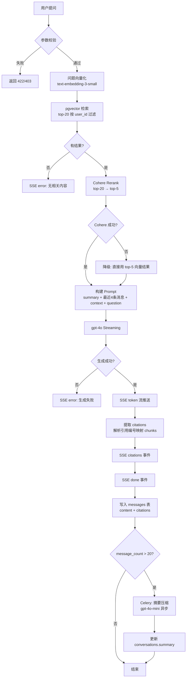

# QA（问答）Spec

> 分类：后端（Backend）

## 1. 功能目标

为用户提供基于已导入知识库的多轮对话问答，每条答案必须附带可点击的引用溯源（citations），答案通过 SSE 流式返回。

## 2. 依赖模块

- `auth` — 用户身份验证，所有 QA 接口需登录
- `knowledge_base` — 已有 `DocumentChunk` 表（含 `source_url`、`heading_path`、`chunk_index`、pgvector embedding）
- `embedding_service` — 复用 `generate_embeddings()` 对问题向量化
- Cohere Rerank API — 对候选 chunks 重排序
- OpenAI gpt-4o — 流式生成答案
- OpenAI gpt-4o-mini — 摘要压缩（异步 Celery task）

## 3. 用户流程

1. 用户登录后进入对话列表页，可创建新对话或继续已有对话
2. 创建对话：`POST /qa/conversations`，返回 `conv_id`
3. 用户在对话页输入问题，点击发送
4. 前端调用 `POST /qa/conversations/{conv_id}/ask`，建立 SSE 连接
5. 后端执行：向量检索 → Cohere Rerank → 构建 prompt → gpt-4o streaming
6. 前端实时渲染 token；流结束后渲染 citations 卡片
7. 后端异步检查是否需要摘要压缩（超过 20 条消息时触发）
8. 用户可继续追问，历史上下文自动携带

## 4. API 设计

### POST /api/v1/qa/conversations

创建新对话。

请求体：无（title 创建时为空，第一次提问后自动更新为问题前 20 字）

响应：
- `conv_id: str` — 对话 ID
- `created_at: datetime`

---

### GET /api/v1/qa/conversations

列出当前用户所有对话。

响应（列表）：
- `conv_id: str`
- `title: str`
- `created_at: datetime`
- `updated_at: datetime`

---

### POST /api/v1/qa/conversations/{conv_id}/ask

提问，SSE 流式返回。

请求体：
- `question: str` — 用户问题（非空，最长 1000 字）

SSE 事件格式：
```
data: {"type": "token", "content": "..."}   # 逐 token 推送
data: {"type": "citations", "data": [...]}  # 流结束前推送
data: {"type": "done"}                      # 流结束标志
data: {"type": "error", "message": "..."}   # 出错时推送后关闭
```

citations 数组元素：
```json
{
  "index": 1,
  "chunk_id": "uuid",
  "source_url": "https://...",
  "heading_path": "Installation > Redis",
  "snippet": "前 200 字截断..."
}
```

---

### GET /api/v1/qa/conversations/{conv_id}/messages

获取对话历史消息列表。

响应（列表）：
- `id: str`
- `role: str` — `user` 或 `assistant`
- `content: str`
- `citations: list` — assistant 消息才有，user 消息为空列表
- `created_at: datetime`

## 5. 数据结构

### conversations 表

- `id: UUID` — 主键
- `user_id: UUID` — 外键 → users.id
- `title: str` — 对话标题（取第一条问题前 20 字）
- `summary: text | null` — 摘要压缩后的历史摘要
- `message_count: int` — 消息条数（每次写入 messages 时 +1），用于触发压缩
- `created_at: datetime`
- `updated_at: datetime`

### messages 表

- `id: UUID` — 主键
- `conversation_id: UUID` — 外键 → conversations.id
- `role: str` — `user` 或 `assistant`
- `content: text` — 消息内容
- `citations: JSONB | null` — 仅 assistant 消息有值
- `created_at: datetime`

citations JSONB 结构：
```json
[
  {
    "index": 1,
    "chunk_id": "uuid",
    "source_url": "https://...",
    "heading_path": "Installation > Redis",
    "snippet": "..."
  }
]
```

## 6. 核心处理规则

**检索链路：**
1. 对用户问题调用 `generate_embeddings()` 得到向量
2. pgvector cosine 相似度检索，过滤条件：`DocumentChunk.knowledge_base.user_id = current_user.id`，取 top-20
3. 调用 Cohere Rerank API，输入 query + top-20 chunks 的 content，取 top-5
4. 构建 prompt（见下）

**Prompt 构建：**
```
system: 你是技术文档助手。只基于提供的上下文回答问题。
        回答中必须用 [1]、[2] 等编号引用对应的上下文来源。
        如果上下文中没有相关信息，回答"根据已有文档，无法回答该问题"。

context:
[1] {heading_path}\n{chunk_content}
[2] ...

history:
{summary（如有）}
User: ...
Assistant: ...
（最近 4 条消息，超过 20 条后 summary 替代旧历史）

user: {当前问题}
```

**摘要压缩触发条件：**
- `message_count > 20` 时，在流结束后异步触发 Celery task
- 取最早的 `message_count - 4` 条消息（保留最近 4 条），用 gpt-4o-mini 生成摘要
- 摘要写回 `conversations.summary`，对应旧消息不删除（保留完整历史可查）

**Citations 提取：**
- 流结束后，解析 assistant 回答中的 `[1]`、`[2]` 引用编号
- 映射回 Rerank 后的 top-5 chunks，提取 `chunk_id`、`source_url`、`heading_path`、`snippet`（前 200 字）
- 写入 `messages.citations`

**对话标题：**
- 创建对话时 title 为空，第一次提问后取问题前 20 字更新 title

## 7. 边界情况

- 问题为空或超过 1000 字：返回 422
- `conv_id` 不属于当前用户：返回 403
- 向量检索结果为空（知识库无内容）：SSE 推送 `{"type": "error", "message": "知识库暂无相关内容"}`
- Cohere API 调用失败：降级为直接使用 top-5 向量检索结果（不 rerank），继续生成
- gpt-4o 调用失败：SSE 推送 `{"type": "error", "message": "生成失败，请重试"}`，不存储该条消息
- 摘要压缩 Celery task 失败：记录日志，不影响正常问答，下次提问时重试检查
- 用户无任何知识库：返回 `{"type": "error", "message": "请先导入知识库"}`

## 8. 错误处理

- 参数错误：返回 422（FastAPI 自动处理）
- 权限错误：返回 403
- Cohere 失败：降级处理，不中断流
- gpt-4o 失败：SSE error 事件 + 关闭连接，不写 DB
- 摘要压缩失败：异步静默失败，写日志

## 9. 测试点

### API

- `POST /qa/conversations` 创建对话，返回正确 conv_id
- `POST /qa/conversations/{conv_id}/ask` 返回 SSE 流，包含 token、citations、done 事件
- `GET /qa/conversations/{conv_id}/messages` 返回正确历史
- 非本人对话返回 403
- 空问题返回 422

### 数据

- messages 表正确写入 role、content、citations
- citations 中 source_url 可追溯到原始 DocumentChunk
- 超过 20 条消息后 conversations.summary 被更新

### RAG 专项

- 答案中 [1][2] 引用编号与 citations 数组 index 一一对应
- citations 的 source_url 指向真实已导入的文档 URL
- 知识库无相关内容时，不生成无来源答案

### 回归

- 不影响 `/knowledge` 接口
- 不影响 `/auth` 接口

## 10. 验收 checklist

- [ ] 创建对话 API 正常
- [ ] 提问 SSE 流正常返回 token
- [ ] citations 事件在 done 之前推送
- [ ] citations 中 source_url 可点击并指向原始文档
- [ ] 多轮对话历史正确携带
- [ ] 超过 20 条消息触发摘要压缩
- [ ] Cohere 失败时降级处理，不中断问答
- [ ] 非本人对话返回 403
- [ ] 所有新增测试通过
- [ ] 不影响现有功能

---

## 流程图

正式图片：



