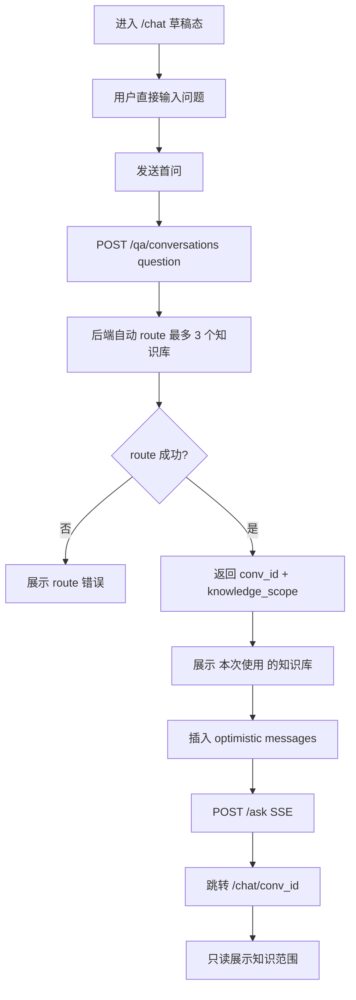

# Chat Question Routed Knowledge Scope Spec

> 分类：前端（Frontend）
> 状态：Draft

## 1. 功能目标

将 Chat 草稿态的“知识库单选”移除，升级为“用户直接提问，系统根据问题自动判断本次会话应该使用哪些知识库”。前端不要求用户明文选择已有 RAG 知识库；后端首问 route 完成后，前端展示“本次使用的知识范围”，并在 citations 中展示来源知识库。

本期不做前端多选知识库，不做全局知识集合管理，不做已有会话内切换范围。自动 route 最多使用 3 个知识库。

## 2. 当前状态

当前前端：

- `/chat` 底部输入区上方展示一个 `<select>`。
- `selectedKnowledgeBaseId` 是单个 number。
- `createConversation(selectedKnowledgeBaseId)` 只提交 `knowledge_base_id`。
- `/chat/[conversationId]` 只读展示当前知识库上下文仍有待补齐。
- citation UI 只展示 `[index] + heading_path`，不展示知识库名称。

## 3. 交互原则

1. 用户不需要先选择知识库，直接输入问题。
2. 系统根据问题自动路由到最多 3 个知识库。
3. route 结果必须在会话创建后展示，避免黑盒。
4. 会话创建后 scope 锁定，后续问题继续使用该 scope。
5. citations 必须展示来源知识库，用户可以核对答案依据。

## 4. UI 设计

### 4.1 `/chat` 草稿态

不展示知识库下拉框，也不展示多选入口。

```text
问我任何文档问题
```

状态：

- 有可用知识库：用户可直接发送问题。
- 无可用知识库：展示导入引导，禁止发送或发送后展示“请先导入文档”。
- 首问发送后，在 assistant draft 上方或输入区上方展示路由状态：
  - `正在判断相关知识库...`
  - route 完成后展示：`本次使用：部署文档、API 文档`
  - 如果 route 失败：展示后端错误。

### 4.2 `/chat/[conversationId]` 已有会话

展示只读范围：

```text
本次使用：README、API 文档、部署文档
```

规则：

- 不展示 checkbox。
- 不允许更改范围。
- 如果 scope 中有已删除知识库，展示快照名称并标记 `已删除`。
- 如果后端返回 `conversation_scope_unavailable`，assistant 错误消息中提示“当前会话范围中的部分知识库已不可用，请新建会话重新选择范围”。

## 5. 状态模型

移除当前单值状态：

```ts
selectedKnowledgeBaseId: number | null
```

不引入 `selectedKnowledgeBaseIds`。新增会话级 route 结果状态：

```ts
activeKnowledgeScope: KnowledgeScope | null
isResolvingKnowledgeScope: boolean
```

草稿缓存从：

```ts
type DraftConversationCache = {
  conversationId: string;
  knowledgeBaseId: number;
};
```

改为：

```ts
type DraftConversationCache = {
  conversationId: string;
  knowledgeScope: KnowledgeScope | null;
};
```

本地记忆：

- 不再保存用户最近选择的知识库。
- 可以缓存最近一次 route 结果，仅用于首问跳转期间避免 UI 闪烁。
- cache key 建议为 `__offercopilot_draft_knowledge_scope__`。

## 6. 前端服务契约

### 6.1 createConversation

从：

```ts
createConversation(knowledgeBaseId: number)
```

改为：

```ts
createConversation(question: string)
```

请求体：

```json
{
  "question": "生产环境怎么配置 Redis？"
}
```

兼容：

- 如果为了平滑迁移，也可提供 `createConversationFromSingleKnowledgeBase(id)` 包装旧调用。
- 本期 Chat 页面应使用 `question` 创建会话，让后端自动 route scope。

### 6.2 Types

新增：

```ts
export type KnowledgeScopeItem = {
  knowledge_base_id: number | null;
  name: string;
  source_url: string;
  deleted?: boolean;
};

export type KnowledgeScope = {
  type: "question_routed";
  items: KnowledgeScopeItem[];
};
```

`ConversationListItem` 新增：

```ts
knowledge_base_ids: number[];
knowledge_scope: KnowledgeScope | null;
```

`Citation` 新增可选字段：

```ts
knowledge_base_id?: number | null;
knowledge_base_name?: string | null;
```

SSE parser 必须兼容旧 citation 缺少这些字段。

## 7. 发送流程

### 7.1 `/chat` 首问

1. 用户输入问题并发送。
2. 前端不校验知识库选择。
3. 调用 `POST /qa/conversations`，提交 `question`。
4. 后端创建会话并返回自动 route 的 `knowledge_scope`。
5. 前端展示 `本次使用：...`。
6. 写入 draft conversation cache，避免跳转闪烁。
7. 插入 optimistic user + assistant draft。
8. 清空输入框。
9. 调用 `POST /qa/conversations/{conv_id}/ask` 发起 SSE。
10. 跳转 `/chat/{conv_id}` 后继续显示只读 scope。

### 7.2 `/chat/[conversationId]` 后续提问

1. 不允许修改范围。
2. 直接使用当前会话 scope。
3. 若后端返回 scope 相关错误，assistant 消息转错误态。

## 8. Citation 展示

消息下方 citation chip：

```text
[1] API 文档 / Auth > Login
```

右侧 / 底部 citation panel：

```text
[1] API 文档
Auth > Login
https://example.com/api
snippet...
```

兼容：

- 如果没有 `knowledge_base_name`，退回当前展示：`heading_path || "Source"`。
- 如果有 `knowledge_base_name`，优先展示知识库名称。

## 9. 错误态

新增错误码展示：

| 错误码 | 前端文案 |
| --- | --- |
| `conversation_scope_missing` | 当前会话没有绑定知识范围，请新建会话 |
| `conversation_scope_unavailable` | 当前会话范围中的部分知识库已不可用，请新建会话重新选择 |
| `knowledge_scope_route_empty` | 没有找到适合回答这个问题的知识库，请换个问法或导入相关文档 |

其他错误沿用现有展示。

## 10. 不做的事

- 不做用户手动多选知识库。
- 不做无提示的 route 结果隐藏。
- 不做已有会话内切换范围。
- 不做全局知识集合 CRUD。
- 不做超过 3 个知识库的自动 route 范围。

## 11. 测试计划

### 组件测试

- 草稿态不展示知识库选择器。
- 首问发送时调用 `createConversation(question)`。
- route 处理中展示“正在判断相关知识库”。
- route 成功后展示最多 3 个知识库。
- 已有会话只读展示范围。
- citation 展示知识库名称。
- 旧 citation 无知识库名称时仍正常展示。

### 服务测试

- `createConversation(question)` 发送 `question`。
- SSE citation parser 兼容新增字段。
- conversation list 类型可承载 `knowledge_scope`。

### 流程测试

- `/chat` 首问自动创建 question-routed scope 会话。
- 首问跳转后范围仍可见。
- 后续提问不出现范围选择器。
- 后端返回 `conversation_scope_unavailable` 时展示明确错误。

## 12. 验收 Checklist

- [ ] 草稿态不展示知识库单选或多选。
- [ ] 首问根据问题自动 route 最多 3 个知识库。
- [ ] 创建会话时提交 `question`。
- [ ] 会话页只读展示 scope。
- [ ] citations 显示来源知识库。
- [ ] 旧单库会话不崩溃。
- [ ] 错误态文案覆盖 scope 相关错误。

## 13. 流程图


