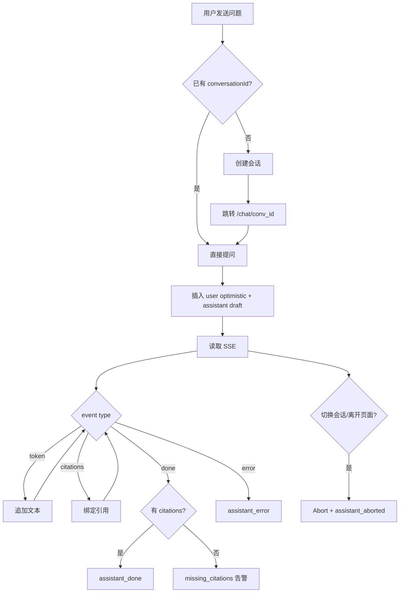

# Chat Streaming Interaction Spec（按当前实现对齐）

> 分类：前端（Frontend）

## 1. 目标

定义当前 Chat 页面的流式问答交互：发送问题、接收 SSE、渲染 citations、处理错误与中断。

---

## 2. 已实现依赖

- `features/chat/components/chat-page.tsx`
- `features/chat/lib/chat-state.ts`
- `lib/stream.ts`
- `services/qa.ts`

---

## 3. 当前交互流程

### 3.1 `/chat` 首问流程

1. 用户输入问题并发送。
2. 前端先调用 `POST /qa/conversations` 创建会话。
3. 跳转到 `/chat/{conv_id}`。
4. 插入 user optimistic message + assistant draft message。
5. 调用 `POST /qa/conversations/{conv_id}/ask`，开始读取 SSE。

### 3.2 `/chat/[conversationId]` 提问流程

1. 用户发送问题。
2. 立即插入 user optimistic message 与 assistant draft。
3. 通过 SSE 按事件更新 assistant draft。

---

## 4. SSE 事件契约（前端消费）

支持事件：

- `token`：追加 assistant 文本
- `citations`：绑定引用数组
- `done`：结束本轮回复
- `error`：失败并展示错误消息

解析约束（`lib/stream.ts`）：

- data 必须是合法 JSON。
- 不支持的事件结构抛 `StreamFormatError`。
- `done/error` 到达后会停止继续读取该 stream。

---

## 5. 状态处理规则（当前实现）

本地消息状态：

- `optimistic_user`
- `assistant_draft`
- `assistant_done`
- `assistant_error`
- `assistant_aborted`

核心规则：

1. `token` 仅追加到当前 `clientId` 对应的 assistant draft。
2. `citations` 仅绑定到当前 `clientId` 对应 assistant 消息。
3. 收到 `done` 时：
   - 若 citations 为空，标记 `assistant_error` 且 `errorCode=missing_citations`。
   - 否则标记 `assistant_done`。
4. 收到 `error` 时标记 `assistant_error`，并保存 `errorCode/errorMessage`。
5. 错误码为 `no_knowledge_base` 或 `no_relevant_context`（或 message 命中“知识库/没有相关”）时，展示“去导入文档”引导。

---

## 6. 中断与切换

当前实现中，切换会话或离开当前会话页会触发 `AbortController.abort()`：

- 中断进行中的 SSE。
- 将当前 assistant draft 标记为 `assistant_aborted`（文案“已停止生成”）。
- 忽略旧请求后续事件。

---

## 7. 错误分类（当前前端可见）

- 会话加载失败：消息区展示错误卡片。
- 发送失败：assistant 消息标记错误或页面错误提示。
- 无知识库/无命中：assistant 错误消息 + “去导入文档”按钮。
- citations 缺失：显示“此答案不能作为可信回答”的契约告警。

---

## 8. 验收基线（当前版本）

- [x] `/chat` 首问可自动创建会话并跳转。
- [x] SSE token 可实时追加显示。
- [x] citations 能绑定并展示。
- [x] done 时执行 citations 契约校验。
- [x] error 时可展示错误并恢复输入可用状态。
- [x] 会话切换/离开可中断 stream，旧流不污染新会话。

---

## 9. 流程图

