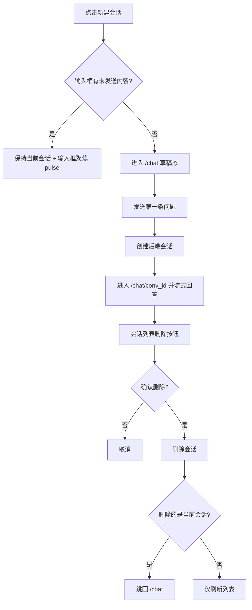

# Chat UI Polish Spec（按当前实现对齐）

> 分类：前端（Frontend）

## 1. 目标

记录当前 Chat UI 的已实现样式与交互，避免 spec 与真实页面偏离。

---

## 2. 当前 UI 结构

### 2.1 页面布局

- 左侧：会话列表（`md` 及以上展示）。
- 右侧：消息流 + 底部输入区。
- 整体浅色系（`slate`），无深色主侧栏。

### 2.2 全局侧边栏（工作台）

- 左侧导航为白底样式。
- 菜单项：`Chat`、`Knowledge`。
- 当前路由高亮（`sky` 色边框/背景）。
- 支持折叠，折叠后显示 tooltip 文案。

### 2.3 会话列表

- 顶部“新建会话”按钮。
- 会话项支持激活态高亮。
- 每项有删除按钮，带二次确认弹层。

---

## 3. 新建与删除会话规则（当前实现）

### 3.1 新建会话

1. 点击“新建会话”不创建后端空会话。
2. 当前输入框有未发送内容时：
   - 不跳转、不创建。
   - 输入框聚焦并触发 pulse 提示。
3. 当前输入为空且在已有会话页时：跳转 `/chat`。
4. 首次真正创建会话发生在发送第一条消息时。

### 3.2 会话标题

- 会话标题来自第一条问题前 20 个字符。
- 前端会话列表仅展示有标题会话。

### 3.3 删除会话

1. 点击列表删除按钮。
2. 显示确认弹层。
3. 确认后调用删除接口。
4. 删除当前会话时回退 `/chat`。

---

## 4. 消息区与引用展示

- 用户消息：右侧深色气泡。
- assistant 消息：左侧浅色边框气泡。
- assistant 当前未展示头像图标。
- citations 以卡片形式展示在 assistant 消息下方，可点击跳转源链接。
- 若缺少 citations，展示红色契约告警文案。

---

## 5. 输入区规则（当前实现）

- 单行输入框（`input`），非多行 textarea。
- Enter 发送。
- streaming 中输入区禁用发送。
- 字数上限 1000。
- placeholder 当前固定：`问我任何文档问题`。
- 发送按钮为圆形图标按钮，hover 有强调样式。

---

## 6. 错误与引导

- 无知识库/无相关内容：assistant 消息内展示引导区块 + “去导入文档”按钮。
- 会话加载失败或删除失败：页面展示错误信息。
- streaming 失败：assistant 转错误态并保留问题上下文。

---

## 7. 已知差异（与原规划相比）

- 未实现 assistant 头像。
- 未实现“placeholder 随知识库状态动态变化”。
- 未实现 `Shift+Enter` 多行输入。
- 会话列表在移动端默认隐藏。

---

## 8. 验收基线（当前版本）

- [x] 新建会话采用“首问创建会话”模式。
- [x] 有未发送输入时点击新建不会打断当前输入。
- [x] 会话支持删除并二次确认。
- [x] 消息区可区分 user / assistant。
- [x] citations 可点击跳转源 URL。
- [x] 缺失 citations 时展示契约告警。
- [x] 无知识库时可从消息区跳转到 `/knowledge`。

---

## 9. 流程图

