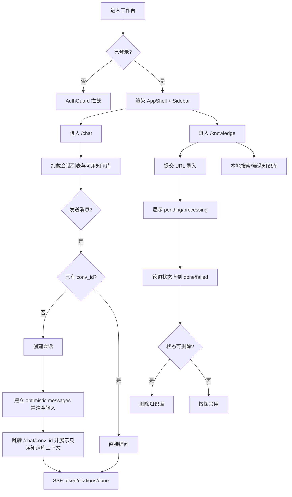

# Frontend Workspace Spec（按当前实现对齐）

> 分类：前端（Frontend）

## 1. 目标

定义当前前端工作台的已实现能力与边界，作为后续迭代基线。

当前工作台围绕两个主页面：

- `/chat` 与 `/chat/[conversationId]`：会话式问答
- `/knowledge`：知识库 URL 导入与状态查看

---

## 2. 已实现模块

- `AuthGuard`：保护工作台路由，未登录用户不可访问。
- `AppShell + Sidebar`：统一工作台壳层，左侧导航含 `Chat`、`Knowledge`。
- `ChatPage`：会话列表、消息区、输入区、SSE 渲染、删除会话。
- `KnowledgePage`：URL 导入、列表展示、状态轮询。
- `services/qa` 与 `lib/stream`：QA API 与 SSE 事件解析。

---

## 3. 页面与流程

### 3.1 工作台壳层

1. 用户进入工作台路由。
2. 通过 `AuthGuard` 校验登录态。
3. 页面展示侧边栏与主内容区。

侧边栏当前行为：

- 白底样式（非深色侧边栏）。
- `Chat`、`Knowledge` 路由高亮。
- 支持折叠/展开（`lg` 及以上显示）。

### 3.2 Chat 页面

1. 页面加载时请求会话列表。
2. 列表中过滤无标题会话（前端仅展示有标题会话）。
3. 进入 `/chat/[conversationId]` 时加载该会话历史消息。
4. 发送问题后进入 SSE 渲染流程（详见 `chat-streaming-interaction.md`）。

### 3.3 新建会话

1. 点击“新建会话”不会立即创建后端会话。
2. 若当前输入框有未发送内容：停留当前页面，仅聚焦输入框并触发轻微 pulse。
3. 若在已有会话页且输入为空：跳转 `/chat`（本地草稿态）。
4. 真正创建会话发生在发送第一条消息时。

### 3.4 删除会话

1. 会话列表项点击删除按钮。
2. 弹出二次确认浮层。
3. 调用删除接口。
4. 删除成功后从列表移除；若当前正查看该会话，回退到 `/chat`。

### 3.5 Knowledge 页面

1. 用户输入 `source_url`（必填）与 `name`（可选）提交导入。
2. 列表展示知识库条目、状态与来源 URL。
3. 页面提供本地搜索/筛选入口，帮助用户快速定位知识库。
4. 对 `pending/processing` 条目每 3 秒轮询状态。
5. `done/failed` 条目支持删除；`pending/processing` 条目不可删除。
6. 支持失败提示与重试加载列表。

---

## 4. API 对齐（前端已接入）

- `POST /api/v1/qa/conversations`
- `GET /api/v1/qa/conversations`
- `GET /api/v1/qa/conversations/{conv_id}/messages`
- `POST /api/v1/qa/conversations/{conv_id}/ask`（SSE）
- `DELETE /api/v1/qa/conversations/{conv_id}`
- `POST /api/v1/knowledge`
- `GET /api/v1/knowledge`
- `GET /api/v1/knowledge/{id}/status`
- `DELETE /api/v1/knowledge/{id}`（本次补充）

---

## 5. 当前已知边界

- 聊天输入框为单行 `input`，不支持 `Shift+Enter` 多行。
- 输入框 placeholder 当前固定为“问我任何文档问题”，尚未接入“按知识库状态变化文案”。
- assistant 消息当前无头像展示。
- 会话列表在中小屏隐藏（仅 `md` 及以上显示）。
- 知识库查询入口以本地筛选为主，暂不提供服务端搜索与分页。

---

## 6. 验收基线（当前版本）

- [x] 登录后可进入工作台壳层并看到左侧导航。
- [x] `/chat` 可发送首问并延迟创建会话。
- [x] `/chat/[conversationId]` 可加载历史消息并继续提问。
- [x] SSE 可流式渲染回答与 citations。
- [x] 会话支持删除并二次确认。
- [x] `/knowledge` 可导入 URL 并查看状态轮询结果。
- [ ] `/chat` 首问发送后输入框立即清空。
- [ ] `/chat` 首问跳转后知识库上下文仍可见。
- [ ] `/knowledge` 支持本地搜索/筛选。
- [ ] `/knowledge` 支持删除 `done/failed` 条目。
- [ ] `/knowledge` 导入按钮具备更明显的主操作样式。

---

## 7. 流程图

