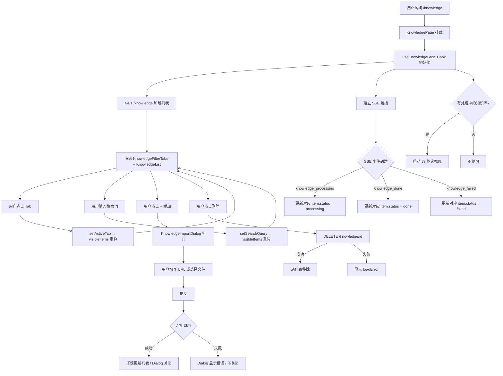

# Knowledge 页面重构 Spec

## 1. 功能目标

重构 `/knowledge` 页面，实现 Notion/Linear 风格的视觉设计升级、状态筛选 Tab、导入表单 Dialog 化，并将业务逻辑提取为独立 Hook，提升可维护性。

## 2. 依赖模块

- 依赖：`@/services/knowledge`（listKnowledgeBases / createKnowledgeBase / uploadKnowledgeBase / deleteKnowledgeBase）
- 依赖：`@/lib/sse`（listenToEvents，SSE 事件订阅）
- 依赖：`@base-ui/react`（Dialog 组件）
- 依赖：`lucide-react`（Trash2 icon）
- 不修改：后端 API、数据库模型、认证逻辑

## 3. 用户流程

1. 用户进入 `/knowledge` 页面，看到知识库列表和顶部标题
2. 点击右上角"+ 添加"按钮，弹出导入 Dialog
3. 在 Dialog 中选择 URL 导入或文件上传，填写信息后提交
4. 提交成功后 Dialog 自动关闭，列表顶部立即出现新增记录（乐观更新，状态为 pending）
5. SSE 事件推送状态变更（processing → done / failed），卡片实时更新
6. 用户可通过顶部 Tab（全部 / 处理中 / 已完成 / 失败）按状态过滤列表
7. 在搜索框输入关键词，在当前 Tab 范围内再次过滤
8. 已完成的知识库可点击删除按钮删除；处理中的知识库显示"索引中暂不可删除"

## 4. API 设计

本次重构不新增后端 API，仅前端层面改动。

已有 API（保持不变）：
- `GET /knowledge` — 获取知识库列表
- `POST /knowledge` — 创建知识库（URL 导入）
- `POST /knowledge/upload` — 文件上传
- `DELETE /knowledge/{id}` — 删除知识库

## 5. 数据结构

本次重构不修改后端数据模型。

### 前端新增类型

```typescript
// hooks/use-knowledge-base.ts
export type KnowledgeTab = "all" | "indexing" | "done" | "failed";

export type ImportPayload = {
  source_url?: string;
  file?: File;
  name?: string;
};
```

### useKnowledgeBase Hook 返回值

| 字段 | 类型 | 说明 |
|------|------|------|
| `items` | `KnowledgeBaseListItem[]` | 全量原始列表（用于计数） |
| `visibleItems` | `KnowledgeBaseListItem[]` | Tab + 搜索双重过滤后的列表 |
| `counts` | `{ all, indexing, done, failed }` | 各 Tab 的数量徽章 |
| `isLoading` | `boolean` | 初始加载状态 |
| `isSubmitting` | `boolean` | 导入提交中 |
| `deletingKnowledgeBaseId` | `number \| null` | 正在删除的记录 ID |
| `loadError` | `string \| null` | 列表加载/删除错误 |
| `submitError` | `string \| null` | 导入提交错误 |
| `activeTab` | `KnowledgeTab` | 当前选中 Tab |
| `searchQuery` | `string` | 搜索关键词 |
| `setActiveTab` | `(tab) => void` | 切换 Tab |
| `setSearchQuery` | `(query) => void` | 更新搜索词 |
| `handleImport` | `(payload) => Promise<void>` | 提交导入（失败时 throw） |
| `handleDelete` | `(id) => Promise<void>` | 删除知识库 |
| `handleRetry` | `() => void` | 重新加载列表 |

## 6. 核心处理规则

### Tab 筛选逻辑
- "处理中" Tab = `status === "pending" || status === "processing"`（与 isIndexing 保持一致）
- `visibleItems` = 先按 activeTab 过滤 → 再按 searchQuery 过滤
- `counts` 始终基于全量 `items` 派生（不受 Tab 和搜索影响）

### Dialog 控制
- `open` 状态由 `KnowledgePage` 持有（受控模式）
- `handleImport` 成功时不 throw，调用方（Dialog）收到正常返回后关闭
- `handleImport` 失败时 throw，Dialog 捕获异常，不关闭，显示错误信息

### 实时更新
- 初始加载：组件挂载时请求一次列表
- SSE 监听：`knowledge_processing` / `knowledge_done` / `knowledge_failed` 事件触发局部更新
- 轮询兜底：当 `items` 中存在 pending/processing 时，每 3 秒全量刷新一次

## 7. 边界情况

- Dialog 提交后若 API 报错，Dialog 不关闭，错误信息显示在表单下方
- 切换 Tab 时搜索词保持不变（联合过滤）
- 当前 Tab 下无数据时，空状态文案随 Tab 变化（而非固定"还没有知识库"）
- SSE 断线时自动降级到轮询，不影响页面使用
- 处理中的知识库不显示删除按钮，仅显示"索引中暂不可删除"文字

## 8. 错误处理

- 列表加载失败：显示红色错误框 + 重试按钮（loadError）
- 导入提交失败：Dialog 内表单下方显示错误信息，Dialog 不关闭（submitError）
- 删除失败：列表区域显示红色错误框（loadError）
- SSE 连接失败：console.error 输出，自动降级到轮询，不展示给用户

## 9. 测试点

### 组件行为

- URL 导入成功 → Dialog 关闭，列表乐观更新，新记录显示 pending 状态
- 搜索框在任意 Tab 下均可进一步过滤
- 切换到"失败" Tab 只显示 failed 状态的知识库
- 点击"+ 添加"按钮打开 Dialog；点击 Dialog 关闭按钮关闭
- Tab 计数数字与实际列表数量一致
- 已完成的知识库可以删除
- 处理中的知识库不显示删除按钮，显示"索引中暂不可删除"
- failed 知识库显示 error_message

### 回归

- 不影响 Chat 页面对知识库列表的消费
- 不影响 SSE 连接和事件处理逻辑

## 10. 验收 checklist

- [ ] `useKnowledgeBase` Hook 提取完成，原有 7 个 useState / 3 个 useEffect 全部迁入
- [ ] 顶部 Header 区域：标题"Knowledge"+ "+" 添加按钮
- [ ] 状态筛选 Tab 正确显示数量，切换后列表即时过滤
- [ ] 搜索框与 Tab 联动（先 Tab 过滤，再关键词过滤）
- [ ] 导入表单移入 Dialog，提交成功后 Dialog 自动关闭
- [ ] 导入失败时 Dialog 不关闭，显示错误信息
- [ ] 卡片扁平化重设计：进度条动画、icon 删除按钮、更紧凑间距
- [ ] 空状态文案随 Tab 变化
- [ ] 深色模式正常显示
- [ ] `pnpm test` 全部通过（含新增测试用例）

---

## 流程图


