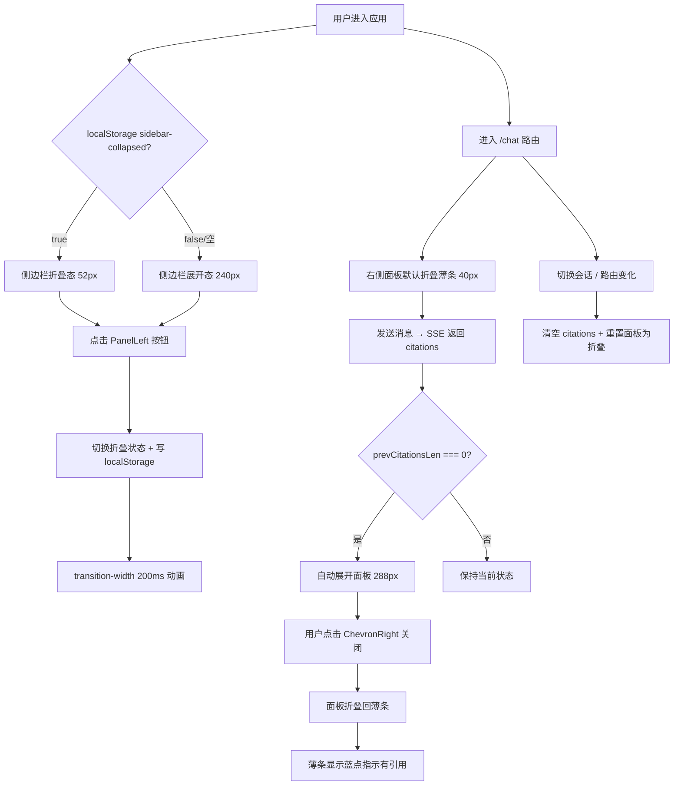

# Spec：侧边栏折叠 + 亮色提亮 + 右侧引用面板可折叠

> 分类：前端（Frontend）

---

## 1. 功能目标

1. **侧边栏折叠/展开**：支持用户手动收缩侧边栏（240px → 52px 图标态），状态 localStorage 持久化
2. **亮色模式提亮**：将页面背景 `#f7f7f8 → #fafafa`、侧边栏 `#ebebeb → #f2f2f2`，整体更明亮
3. **右侧引用面板可折叠**：面板默认折叠（薄条 40px），收到 citations 后自动展开，用户可手动关闭

---

## 2. 依赖模块

- `workspace`（AppShell / Sidebar）：侧边栏折叠 + 右面板折叠
- `chat`（ChatInput / MessageBubble / MessageList）：颜色更新
- `knowledge`（KnowledgePage / KnowledgeImportForm）：颜色更新
- `auth`（AuthGuard / AuthShell）：颜色更新
- 新增 lucide 图标：`PanelLeftClose`、`PanelLeftOpen`、`ChevronRight`（已安装 lucide-react，无需新增依赖）
- **不涉及任何后端 API 变更**

---

## 3. 数据结构 / 状态

### 侧边栏
```ts
// sidebar.tsx
const [isCollapsed, setIsCollapsed] = useState<boolean>(() => {
  if (typeof window === "undefined") return false;
  return localStorage.getItem("sidebar-collapsed") === "true";
});
```

### 右侧面板
```ts
// app-shell.tsx → RightPanel
const [isPanelCollapsed, setIsPanelCollapsed] = useState(true); // 默认折叠
const prevCitationsLen = useRef(0);
```

---

## 4. 执行阶段

### 阶段 A：亮色模式提亮（颜色批量替换）✅

**修改文件（11 个）：**

| 文件 | 改动 |
|------|------|
| `src/app/globals.css` | `--bg` / `--background`: `#f7f7f8→#fafafa`；`--left-panel`: `#ebebeb→#f2f2f2` |
| `src/features/workspace/components/app-shell.tsx` | `bg-[#f7f7f8]` × 2 → `bg-[#fafafa]` |
| `src/features/workspace/components/sidebar.tsx` | `bg-[#ebebeb]` → `bg-[#f2f2f2]` |
| `src/features/chat/components/chat-page.tsx` | `bg-[#f7f7f8]` → `bg-[#fafafa]` |
| `src/features/chat/components/chat-input.tsx` | `bg-[#f7f7f8]` → `bg-[#fafafa]` |
| `src/features/chat/components/message-list.tsx` | `bg-[#f7f7f8]` → `bg-[#fafafa]` |
| `src/features/chat/components/message-bubble.tsx` | `bg-[#ebebeb]`（AI 头像）→ `bg-[#f2f2f2]` |
| `src/features/knowledge/components/knowledge-page.tsx` | `bg-[#f7f7f8]` → `bg-[#fafafa]` |
| `src/features/knowledge/components/knowledge-import-form.tsx` | `bg-[#f7f7f8]` → `bg-[#fafafa]`；pill tabs `bg-[#ebebeb]` → `bg-[#f2f2f2]` |
| `src/features/auth/components/auth-guard.tsx` | `bg-[#f7f7f8]` → `bg-[#fafafa]` |
| `src/features/auth/components/auth-shell.tsx` | `bg-[#f7f7f8]` → `bg-[#fafafa]` |

**验证：** `pnpm run build` 通过；亮色模式视觉更明亮，暗色模式不受影响。

---

### 阶段 B：右侧引用面板可折叠

**修改文件：** `src/features/workspace/components/app-shell.tsx`

**核心逻辑：**
- 新增 `isPanelCollapsed` state（默认 `true`）+ `prevCitationsLen` ref
- 路由切换时：清空 citations + 重置为折叠
- citations 首次到来（0 → >0）：自动展开
- 折叠态：`w-10` 薄条，显示展开按钮 + 有 citations 时蓝点指示
- 展开态：`w-72`，header 右侧加关闭按钮（ChevronRight）
- `transition-[width] duration-200 ease-in-out`

**验证：** `pnpm run build` 通过；面板默认折叠，发消息后自动展开，手动关闭后维持折叠，切换会话重置。

---

### 阶段 C：侧边栏折叠/展开

**修改文件：** `src/features/workspace/components/sidebar.tsx`

**核心变更：**
1. 新增 `isCollapsed` state（localStorage 持久化，SSR 安全初始化）
2. `<aside>` 加 `transition-[width] duration-200`，切换 `w-60` / `w-[52px]`
3. 顶部：折叠时隐藏品牌文字，只显示 Logo 图标
4. 中部：折叠时 `hidden` 隐藏 ConversationList 等
5. 底部导航项：折叠时只显示图标 + tooltip（同 ThemeToggle 的 tooltip 模式）
6. 切换按钮：底部 nav 与 ThemeToggle 之间，`PanelLeftClose` / `PanelLeftOpen` 图标
7. 传递 `isCollapsed` 给 `<ThemeToggle>` 和 `<UserMenu>`（均已支持该 prop）

**验证：** `pnpm run build` 通过；折叠展开平滑，刷新持久化，tooltip 正常，ThemeToggle/UserMenu 折叠态正确。

---

## 5. 边界情况

- 移动端（`< 1024px`）：侧边栏本身已 `hidden lg:flex`，折叠逻辑不影响移动端
- Safari 不支持 `transition-[width]`：降级为即时切换，不影响功能
- SSR：`isCollapsed` 使用懒初始化 `() => { if (typeof window === "undefined") return false; ... }`
- 右面板在 `/knowledge` 路由不渲染（`showRightPanel = pathname.startsWith("/chat")`），不受影响

---

## 6. 测试点

- [ ] 亮色模式：page bg `#fafafa`，sidebar `#f2f2f2`，暗色不变
- [ ] 折叠按钮可见，点击后宽度 200ms 平滑过渡到 52px
- [ ] 刷新后侧边栏记忆上次折叠状态
- [ ] 折叠态：只显示图标，hover 显示 tooltip，ThemeToggle 和 UserMenu 正常
- [ ] 右侧面板默认显示为薄条（40px），无闪烁
- [ ] 发送消息并收到 citations → 面板自动展开
- [ ] 点击关闭（ChevronRight）→ 面板收缩回薄条
- [ ] 切换会话 / 路由 → 面板重置为薄条
- [ ] `pnpm run build` 零 TypeScript 错误

---

## 7. 验收 checklist

- [ ] 亮色整体视觉明亮，不影响暗色模式
- [ ] 侧边栏折叠展开动画流畅，状态持久化
- [ ] 右侧面板默认折叠，citations 到来自动展开，可手动关闭
- [ ] 所有现有功能（发消息、知识库导入、登录注册）回归正常
- [ ] `pnpm run build` 通过

---

## 8. 流程图


