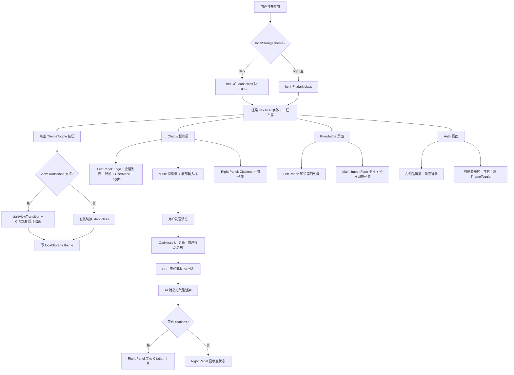

****# UI 全面重构 Spec：暗色主题 + 亮色美化 + 排版重构

> 分类：前端（Frontend）

## 1. 功能目标

为现有开发者文档 RAG 问答助手完成三项 UI 升级：
1. 带圆形扩展动画的主题切换（亮色 / 暗色），使用 `react-theme-switch-animation` 库
2. 亮色 UI 视觉美化（参考 Claude.ai 风格，提升层次感）
3. 排版重构：三栏式布局（左侧 Panel + 主区域 + 右侧 Citations 面板）

---

## 2. 依赖模块

- workspace（AppShell / Sidebar）、chat、knowledge、auth
- 新增 npm 依赖：`react-theme-switch-animation`（View Transitions CIRCLE 动画）
- Next.js 内置：`next/font/google`（Inter 字体）
- **不涉及任何后端 API 变更**

---

## 3. 用户流程

1. 用户首次进入应用，默认亮色主题
2. 点击 Sidebar 底部的 ThemeToggle 按钮
3. 触发 CIRCLE 圆形扩展动画，UI 切换为暗色
4. 刷新页面，主题持久化（localStorage），无 FOUC 闪白
5. 再次点击切回亮色，同样有圆形扩展动画

---

## 4. 新排版结构

### Chat 页面（三栏布局）

```
┌──────────────────┬───────────────────────────────┬──────────────┐
│  Left Panel      │         Main Area              │ Right Panel  │
│  (240px)         │         (flex-1)               │ (288px, lg+) │
│                  │                                │              │
│  Logo + Title    │  消息流（纯内容区域）           │  引用来源     │
│  ─────────────   │                                │  标题        │
│  会话列表         │  [消息气泡 / AI 无气泡]        │  ─────────   │
│  + 新建按钮      │                                │  Citation    │
│                  │                                │  卡片列表    │
│  ─────────────   │  ─────────────────────────     │              │
│  Chat / Know     │  [输入框（固定底部）]           │              │
│  UserMenu        │                                │              │
│  ThemeToggle     │                                │              │
└──────────────────┴───────────────────────────────┴──────────────┘
```

### Knowledge 页面

- 左侧 Panel 中部：知识库条目简列表
- 主区域：ImportForm（顶部卡片）+ KnowledgeList（卡片网格）
- 右侧 Panel：无（隐藏）

### Auth 页面

- 不参与三栏结构
- 右侧表单区右上角加 ThemeToggle 按钮

---

## 5. 视觉规范

### 配色（亮色）

| 元素 | 色值 |
|------|------|
| 页面背景 | `#f7f7f8` |
| 左侧 Panel 背景 | `#ebebeb` |
| 卡片 / 面板 | `#ffffff` |
| 主要文字 | `#0f172a` |
| 次要文字 | `#64748b` |
| Accent | `#2f6df6`（保持） |
| 分割线 | `rgba(148,163,184,0.24)` |

### 配色（暗色）

| 元素 | 色值 |
|------|------|
| 页面背景 | `#212121` |
| 左侧 Panel 背景 | `#171717` |
| 卡片 / 面板 | `#2f2f2f` |
| 主要文字 | `#ececec` |
| 次要文字 | `#8e8ea0` |
| Accent | `#4f8ef7` |
| 分割线 | `rgba(51,65,85,0.6)` |

### 字体

- **Inter**（通过 `next/font/google` 引入），替换现有 Arial
- 正文 `14px`，标题 `16–18px`，辅助 `12px`
- 字重：`400` 正文，`500` 标签，`600` 标题

### 消息气泡（Claude.ai 风格）

| 消息类型 | 样式 |
|----------|------|
| 用户消息 | 圆角气泡，`#2f6df6` 背景，白字，居右，`max-w-[75%]` |
| AI 消息 | **无气泡**，左对齐，前置机器人图标，文字直排 |
| 消息间距 | `gap-6` |

---

## 6. 执行阶段与文件变更

### 阶段 0：依赖安装 + Spec 创建 ✅

```bash
pnpm add react-theme-switch-animation
```

**修改文件**：`package.json`、`spec/frontend/ui-redesign-dark-mode.md`（本文件）

---

### 阶段 1：CSS 基础层

**修改文件**：`frontend/src/app/globals.css`

**操作内容**：

1. 在 `@import "tailwindcss"` 后插入：
   ```css
   @variant dark (&:where(.dark, .dark *));
   ```

2. 在 `@theme inline` 中补充语义 token 映射（供 button/input/card 使用）：
   ```css
   @theme inline {
     --color-bg: var(--bg);
     --color-ink: var(--ink);
     --color-background: var(--background);
     --color-foreground: var(--foreground);
     --color-card: var(--card);
     --color-muted: var(--muted);
     --color-border: var(--border);
   }
   ```

3. 在 `:root` 中补充缺失的语义 token（button/input/card 已引用但未定义）：
   ```css
   --background: #ffffff;
   --foreground: #0f172a;
   --card: #ffffff;
   --card-foreground: #0f172a;
   --muted: #f1f5f9;
   --muted-foreground: #64748b;
   --border: rgba(148, 163, 184, 0.32);
   --input: rgba(148, 163, 184, 0.32);
   --ring: #2f6df6;
   --primary: #0c1530;
   --primary-foreground: #ffffff;
   --secondary: #f1f5f9;
   --secondary-foreground: #0f172a;
   --destructive: #ef4444;
   --destructive-foreground: #ffffff;
   ```
   同时将 `--bg` 更新为 `#f7f7f8`（微暖灰）

4. 新增 `.dark {}` 覆盖块：
   ```css
   .dark {
     --bg: #212121;
     --ink: #ececec;
     --line: rgba(51, 65, 85, 0.60);
     --surface-muted: rgba(15, 23, 42, 0.72);
     --accent: #4f8ef7;
     --accent-strong: #3b72e0;
     --accent-soft: #1e3a5f;
     --cta: #ececec;
     --cta-hover: #f8fafc;
     --background: #212121;
     --foreground: #ececec;
     --card: #2f2f2f;
     --card-foreground: #ececec;
     --muted: #2f2f2f;
     --muted-foreground: #8e8ea0;
     --border: rgba(51, 65, 85, 0.60);
     --input: rgba(51, 65, 85, 0.60);
     --ring: #4f8ef7;
     --primary: #ececec;
     --primary-foreground: #212121;
     --secondary: #2f2f2f;
     --secondary-foreground: #ececec;
     --destructive: #f87171;
   }
   ```

5. 补充 `.dark .offerpilot-input` 暗色规则：
   ```css
   .dark .offerpilot-input {
     background: rgba(47, 47, 47, 0.92);
     color: #ececec;
     border-color: var(--line);
   }
   .dark .offerpilot-input:focus {
     background: #2f2f2f;
     border-color: rgba(79, 142, 247, 0.7);
   }
   ```

---

### 阶段 2：根布局 Inter 字体 + 防 FOUC

**修改文件**：`frontend/src/app/layout.tsx`

**操作内容**：

1. 引入 Inter 字体：
   ```ts
   import { Inter } from "next/font/google";
   const inter = Inter({ subsets: ["latin"], variable: "--font-sans" });
   ```

2. `<html>` 加 `inter.variable`，`<body>` 改为 `bg-[var(--bg)] text-[var(--ink)]`

3. 在 `<body>` 内最前面插入内联同步脚本（防 FOUC）：
   ```tsx
   <script
     dangerouslySetInnerHTML={{
       __html: `
         try {
           var t = localStorage.getItem('theme');
           if (t === 'dark' || (!t && window.matchMedia('(prefers-color-scheme: dark)').matches)) {
             document.documentElement.classList.add('dark');
           }
         } catch(e) {}
       `,
     }}
   />
   ```

---

### 阶段 3：ThemeToggle 组件

**新建文件**：`frontend/src/features/workspace/components/theme-toggle.tsx`

**实现要点**：

```
"use client"

Props: isCollapsed?: boolean

核心逻辑：
- import { useModeAnimation, ThemeAnimationType } from "react-theme-switch-animation"
- const { ref, toggleSwitchTheme, isDarkMode } = useModeAnimation({
    animationType: ThemeAnimationType.CIRCLE,
    duration: 750,
    globalClassName: "dark",
  })
- useEffect 中初始化：读取 localStorage.theme 或系统偏好设置初始 dark state
- onClick 回调：
  1. 调用 toggleSwitchTheme()（内部通过 View Transitions CIRCLE 动画切换 html.dark）
  2. 写入 localStorage: theme = isDarkMode ? 'light' : 'dark'（切换前的状态取反）
- 降级处理：useModeAnimation 库内部已处理 View Transitions 不支持情况

图标：
- isDarkMode = false → Moon 图标（"切换暗色"）
- isDarkMode = true  → Sun 图标（"切换亮色"）

折叠态（isCollapsed=true）：只显示图标 + tooltip（样式与 Sidebar 其他 tooltip 一致）
展开态（isCollapsed=false）：图标按钮
```

---

### 阶段 4：三栏布局重构（核心）

**修改文件**：
- `frontend/src/features/workspace/components/app-shell.tsx`
- `frontend/src/features/workspace/components/sidebar.tsx`
- `frontend/src/features/chat/components/chat-page.tsx`
- `frontend/src/features/chat/components/conversation-list.tsx`

**app-shell.tsx 变化**：

当前结构：`flex（sidebar + main）`
新结构：`flex（left-panel + main + right-panel）`

```tsx
// 新布局骨架
<div className="flex h-screen bg-[#f7f7f8] dark:bg-[#212121]">
  <LeftPanel />           {/* 240px，含会话/知识库列表 */}
  <main className="flex-1 overflow-hidden">
    {children}
  </main>
  <RightPanel />          {/* 288px，lg+ 展示，由 chat page 控制显隐 */}
</div>
```

Right Panel 通过 React Context 或 props 传递 citations 数据，初始为空态。

**sidebar.tsx（改为 LeftPanel）**：

新结构（从上到下）：
```
背景：bg-[#ebebeb] dark:bg-[#171717]，无右边框（靠颜色区分）
宽度：固定 w-60（240px），不再可折叠（或保留折叠，视实现复杂度）

顶部区（h-14）：
  Logo 图标 + "文档助手" 文字

中部区（flex-1 overflow-y-auto）：
  路由 = /chat/* → 渲染 ConversationList（会话列表）
  路由 = /knowledge* → 渲染 KnowledgeSideList（知识库简列表）

底部区（border-t）：
  Chat 导航按钮 + Knowledge 导航按钮（两个并排或竖排）
  分割线
  UserMenu
  ThemeToggle
```

导航项样式（Claude.ai 风格，去掉 border-l-2）：
```
普通：rounded-lg px-3 py-2 text-sm text-[#64748b] hover:bg-white/60 dark:hover:bg-white/10
活跃：rounded-lg px-3 py-2 text-sm bg-white dark:bg-[#2f2f2f] shadow-sm font-medium text-[#0f172a] dark:text-[#ececec]
```

**chat-page.tsx 变化**：

移除：顶部导航栏（知识库选择器区域）
移除：内嵌的 ConversationList 侧栏
保留：消息流 + 输入框

知识库选择器改为：放在输入框上方的小型 inline 选择区（仅在 `/chat` 草稿态展示）

---

### 阶段 5：消息 UI 升级 + Citations 迁移

**修改文件**：
- `frontend/src/features/chat/components/message-bubble.tsx`
- `frontend/src/features/chat/components/message-list.tsx`
- `frontend/src/features/chat/components/citation-list.tsx`

**message-bubble.tsx（Claude.ai 风格）**：

用户消息：
```tsx
// 圆角气泡，蓝色背景，居右
<div className="flex justify-end">
  <div className="max-w-[75%] rounded-2xl rounded-br-sm bg-[#2f6df6] dark:bg-[#4f8ef7] px-4 py-3 text-sm text-white">
    {content}
  </div>
</div>
```

AI 消息（无气泡）：
```tsx
// 左对齐，前置图标，文字直排
<div className="flex gap-3">
  <div className="mt-0.5 size-7 shrink-0 rounded-full bg-[#ebebeb] dark:bg-[#2f2f2f] flex items-center justify-center">
    <BotIcon className="size-4 text-[#2f6df6]" />
  </div>
  <div className="flex-1 text-sm text-[#0f172a] dark:text-[#ececec] leading-relaxed">
    {content}
    <CitationList citations={citations} />  {/* 引用仍在消息下方小型展示 */}
  </div>
</div>
```

**citation-list.tsx**：

两处展示：
1. 消息下方：小型引用链接列表（保留，简化样式）
2. 右侧 Panel：完整卡片展示（新增）

右侧 Panel 引用卡片：
```
bg-white dark:bg-[#2f2f2f] rounded-xl border border-[rgba(148,163,184,0.24)] dark:border-slate-700
hover:-translate-y-0.5 transition-transform shadow-sm
标题：文字截断，14px font-medium
来源：小字 URL，可点击
```

**message-list.tsx**：

- 背景：`bg-[#f7f7f8] dark:bg-[#212121]`
- 消息间距：`space-y-6`
- 滚动：`overflow-y-auto flex-1`

---

### 阶段 6：输入框视觉升级

**修改文件**：`frontend/src/features/chat/components/chat-input.tsx`

**变化**：
- 容器圆角：`rounded-2xl`（更大）
- 背景：`bg-white dark:bg-[#2f2f2f]`
- 焦点光晕：`focus-within:ring-2 focus-within:ring-[#2f6df6]/20`
- 阴影：`shadow-md`
- 发送按钮：圆形，内嵌在右侧，`size-8 rounded-full bg-[#2f6df6] text-white`
- 容器整体：`border border-[rgba(148,163,184,0.24)] dark:border-slate-700`

---

### 阶段 7：Knowledge 页面重构

**修改文件**：
- `frontend/src/features/knowledge/components/knowledge-page.tsx`
- `frontend/src/features/knowledge/components/knowledge-import-form.tsx`
- `frontend/src/features/knowledge/components/knowledge-list.tsx`
- `frontend/src/features/knowledge/components/knowledge-status-badge.tsx`

**knowledge-import-form.tsx**：
- 卡片式：`bg-white dark:bg-[#2f2f2f] rounded-2xl shadow-sm p-6`
- Tab 切换改为 Pill 风格（segmented control）：
  ```
  bg-[#ebebeb] dark:bg-[#171717] rounded-full p-1
  活跃项：bg-white dark:bg-[#2f2f2f] rounded-full shadow-sm
  ```

**knowledge-list.tsx**：

改为卡片网格：
```tsx
<div className="grid grid-cols-1 md:grid-cols-2 xl:grid-cols-3 gap-3">
  {items.map(item => (
    <KnowledgeCard key={item.id} item={item} />
  ))}
</div>
```

每个卡片：
```
bg-white dark:bg-[#2f2f2f] rounded-xl border shadow-sm p-4
hover:-translate-y-0.5 transition-transform
顶部：状态点 + 标题
中部：来源 URL（截断）
底部：创建时间 + 操作按钮
```

**knowledge-status-badge.tsx**：

改为点状指示器：
```tsx
// 点状脉冲 + 文字
const statusMeta = {
  pending:    { dot: "bg-amber-400",                        text: "等待中",   label: "border-amber-200 bg-amber-50 text-amber-800 dark:border-amber-800/50 dark:bg-amber-900/20 dark:text-amber-300" },
  processing: { dot: "bg-blue-500 animate-pulse",           text: "处理中",   label: "border-sky-200 bg-sky-50 text-sky-800 dark:border-sky-800/50 dark:bg-sky-900/20 dark:text-sky-300" },
  done:       { dot: "bg-emerald-500",                      text: "已完成",   label: "border-emerald-200 bg-emerald-50 text-emerald-800 dark:border-emerald-800/50 dark:bg-emerald-900/20 dark:text-emerald-300" },
  failed:     { dot: "bg-rose-500",                         text: "失败",     label: "border-rose-200 bg-rose-50 text-rose-800 dark:border-rose-800/50 dark:bg-rose-900/20 dark:text-rose-300" },
}
// 渲染：<span class="dot" /> + text，整体包在 label class 的 badge 里
```

---

### 阶段 8：Auth 页面升级

**修改文件**：
- `frontend/src/features/auth/components/auth-shell.tsx`
- `frontend/src/features/auth/components/auth-access-panel.tsx`
- `frontend/src/features/auth/components/register-form.tsx`
- `frontend/src/features/auth/components/auth-guard.tsx`
- `frontend/src/features/auth/components/auth-form-header.tsx`
- `frontend/src/features/auth/components/password-input.tsx`

**auth-shell.tsx**：
- 左侧品牌区背景：`from-slate-950 via-indigo-950 to-slate-950`（渐变升级）
- 右侧表单区：`bg-[#f7f7f8] dark:bg-[#212121]`
- 右侧右上角加 ThemeToggle 按钮（绝对定位）

**auth-access-panel.tsx + register-form.tsx**：
- 表单卡片：`rounded-3xl shadow-lg bg-white dark:bg-[#2f2f2f]`
- 标题 `text-slate-950 dark:text-[#ececec]`
- 描述 `text-slate-500 dark:text-[#8e8ea0]`
- Label `text-slate-800 dark:text-slate-200`
- Input `bg-white dark:bg-[#212121] border-slate-200 dark:border-slate-700`
- 提交按钮：`bg-slate-950 dark:bg-[#ececec] text-white dark:text-[#212121]`
- 错误提示：`bg-rose-50 dark:bg-rose-900/20 border-rose-200 dark:border-rose-800/50 text-rose-600 dark:text-rose-400`
- 成功提示：`bg-emerald-50 dark:bg-emerald-900/20 ...`

**auth-guard.tsx**：
- 加载态：`bg-[#f7f7f8] dark:bg-[#212121] text-slate-500 dark:text-[#8e8ea0]`
- Spinner：`border-slate-300 dark:border-slate-600 border-t-slate-700 dark:border-t-slate-300`

---

### 阶段 9：dark: variants 全扫描

**扫描范围**：阶段 4–8 之外遗漏的 hardcoded 亮色类

重点检查：
- `user-menu.tsx`：tooltip `bg-slate-950` → `dark:bg-[#ececec] dark:text-[#212121]`
- `no-knowledge-prompt.tsx`：`bg-amber-50 border-amber-200` → 加 dark 对应
- `conversation-list.tsx`（删除确认弹窗）：遮罩 `bg-slate-950/30 dark:bg-black/50`；内部卡片 `bg-white dark:bg-[#2f2f2f]`
- `not-found.tsx`：`bg-white` → 加 `dark:bg-[#212121]`
- UI 基础组件（button/input/card）：阶段 1 补齐 CSS 变量后**自动生效**，无需手动改动

---

### 阶段 10：全量回归 + build 检查

```bash
pnpm run build        # TypeScript 编译检查
pnpm run dev          # 启动本地开发服务器手动验证
```

逐项确认验收 checklist。

---

## 7. 颜色映射速查表（dark: 替换规则）

| 亮色类名 | 暗色替换 | 说明 |
|----------|----------|------|
| `bg-white` | `dark:bg-[#2f2f2f]` | 主卡片/面板 |
| `bg-slate-50` / `bg-[#f7f7f8]` | `dark:bg-[#212121]` | 页面级背景 |
| `bg-[#ebebeb]`（Left Panel）| `dark:bg-[#171717]` | 侧边栏背景 |
| `bg-slate-100` | `dark:bg-[#3a3a3a]` | 悬浮高亮 |
| `bg-slate-950`（CTA 按钮）| `dark:bg-[#ececec]` | 主按钮（翻转）|
| `text-white`（CTA 按钮文字）| `dark:text-[#212121]` | 主按钮文字（翻转）|
| `text-slate-950` | `dark:text-[#ececec]` | 主标题 |
| `text-slate-900` | `dark:text-[#ececec]` | 强调文字 |
| `text-slate-800` | `dark:text-slate-200` | Label 文字 |
| `text-slate-600` | `dark:text-[#8e8ea0]` | 次要文字 |
| `text-slate-500` | `dark:text-[#8e8ea0]` | 辅助文字 |
| `text-slate-400` | `dark:text-slate-500` | 最弱文字 |
| `border-slate-100` | `dark:border-slate-800` | 最浅分割线 |
| `border-slate-200` | `dark:border-slate-700` | 标准边框 |
| `border-slate-300` | `dark:border-slate-600` | 稍重边框 |
| `hover:bg-slate-100` | `dark:hover:bg-[#3a3a3a]` | 悬浮高亮 |
| `hover:bg-slate-50` | `dark:hover:bg-[#3a3a3a]/50` | 轻度悬浮 |
| `hover:text-slate-950` | `dark:hover:text-[#ececec]` | 悬浮文字 |
| `bg-sky-50 text-sky-700` | `dark:bg-sky-900/30 dark:text-sky-300` | 活跃导航 |
| `border-l-sky-500` | 直接保留（对比度足够）| 活跃左边框 |
| `bg-violet-50 text-violet-700` | `dark:bg-violet-900/30 dark:text-violet-300` | 标签/会话 |
| `bg-rose-50 text-rose-600` | `dark:bg-rose-900/20 dark:text-rose-400` | 错误提示 |
| `bg-emerald-50 text-emerald-700` | `dark:bg-emerald-900/20 dark:text-emerald-400` | 成功提示 |
| `bg-amber-50 text-amber-800` | `dark:bg-amber-900/20 dark:text-amber-300` | 警告/pending |
| `bg-slate-950/30`（遮罩）| `dark:bg-black/50` | 模态框遮罩 |
| `bg-white/95`（输入框毛玻璃）| `dark:bg-[#2f2f2f]/95` | 输入框背景 |

---

## 8. 边界情况

- 移动端（`< 1024px`）：左侧 Panel 和右侧 Panel 均隐藏，主区域全宽，无水平滚动
- 会话列表为空：Left Panel 中部显示空状态文案"发送消息开始第一次对话"
- 无 Citations：Right Panel 显示空状态图标 + "暂无引用"，面板本身不隐藏
- Safari 旧版不支持 View Transitions：`react-theme-switch-animation` 内部已降级为直接切换，无动画
- SSR：`layout.tsx` 内联同步 `<script>` 防止暗色主题 FOUC

---

## 9. 错误处理

- ThemeToggle 动画失败：库内部 try/catch，直接切换 class，不中断功能
- Inter 字体加载失败：fallback 到 `system-ui, Arial`
- 会话列表迁移后的状态传递：通过路由参数（`conversationId`）维持，不引入额外 Context

---

## 10. 关键风险

| 风险 | 说明 | 缓解方案 |
|------|------|----------|
| FOUC | SSR 首屏不知道用户主题，先渲染亮色再切暗色会闪 | layout.tsx 内联同步 script，CSS 渲染前执行 |
| SSR 安全 | `document` 在服务端不存在 | ThemeToggle 中 `isDarkMode` 在 `useEffect` 初始化 |
| 会话列表迁移 | ConversationList 从 chat-page 移入 Sidebar，功能逻辑不变，只需路由参数传递 | 仅迁移渲染位置，不修改状态逻辑 |
| status-badge 动态 class | Tailwind JIT 无法识别动态拼接的类名 | 所有暗色类写入完整静态字符串 |
| `react-theme-switch-animation` API | 库版本可能与 README 有差异 | 安装后先验证 useModeAnimation 返回值，再写组件 |

---

## 11. 测试点

### 视觉

- CIRCLE 动画从点击位置扩展，750ms 完成
- 刷新后主题持久化，无 FOUC 白色闪烁
- 三栏布局在 1280px / 1440px 下比例正确
- 移动端 375px 只显示主区域，无水平溢出

### 功能回归

- 发送消息、SSE 流式回复正常
- 会话创建（首问创建）、删除（二次确认）正常
- 知识库 URL 导入 / PDF 上传正常
- Citations 引用卡片可点击跳转外链
- Auth 登录 / 注册 / 忘记密码流程正常

### 暗色覆盖率

- Chat / Knowledge / Auth 三个功能区均正确显示暗色
- 无明显遗漏的硬编码亮色类

---

## 12. 验收 checklist

- [ ] ThemeToggle CIRCLE 动画正常，从按钮位置扩展
- [ ] 主题切换持久化（localStorage），刷新无 FOUC
- [ ] 三栏布局结构正确（lg 1024px+）
- [ ] 移动端布局不破坏（左右 Panel 隐藏）
- [ ] 用户消息蓝色圆角气泡，AI 消息无气泡前置图标
- [ ] Citations 在右侧 Panel 正确展示，无引用时显示空状态
- [ ] 知识库卡片网格布局正确（1/2/3 列响应式）
- [ ] Status Badge 改为点状指示器
- [ ] 暗色下 Chat / Knowledge / Auth 所有页面无明显遗漏
- [ ] Inter 字体已替换（开发工具 Network 可见字体加载）
- [ ] 所有现有功能回归测试通过
- [ ] `pnpm run build` 无 TypeScript 错误

---

## 流程图


